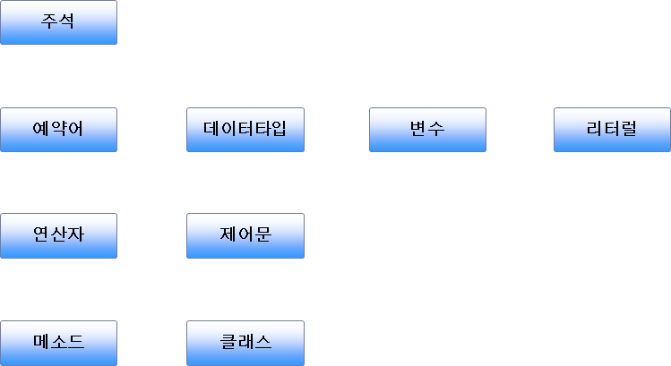
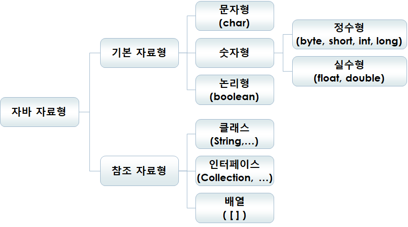

# JAVA

* 객체지향 프로그래밍(OOP) 언어
* 1995년 인터넷의 급격한 발전과 더불어 웹에 바로 적용할 수 있는 언어로 탈바꿈
* 특징
  * 단순한 문법
  * 객체지향 언어(OOP)
    * 추상화
    * 캡슐화
    * 상속
    * 다형성
  * 플랫폼 독립성
  * 메모리 자동 관리(Garbage Collection)
  * 보안성
  * 쉬운 예외처리, 멀티스레드, 네트위킹 등
* 자바 플랫폼 종류

  * Java SE(Java Platform - Standard Edition)
  * Java EE(Java Platform - Enterprise Edition)
  * Java ME(Java Platform - Micro Edition)
* 자바로 작성할 수 있는 프로그램 종류
  * Desktop Application
  * Applet
  * Servelt/JSP
  * Java Beans
  * Enterprise Java Beans
  * Mobile Application 등
* JDK에 포함된 다양한 개발 도구
  * javac.exe : 자바 컴파일러
    * javac 자바파일.java
  * java.exe : 자바 인터프리터
    * java 자바파일
  * javadoc.exe : 자바 HTML Document Generator
    * javadoc 자바파일.java
  * javap.exe : 자바 역컴파일러
    * javap 자바파일[.class]


### 자바 응용 프로그램 기본 구조

* 클래스 정의
  * 어플리케이션을 구성하는 가장 중요한 기본 단위
  * 클래스의 이름은 첫 문자를 대문자로 하는 것이 관례
  * 소스파일 저장 시 파일명이 클래스명과 반드시 일치해야 함
* 자바 응용 프로그램 동작 원리
  * 개발자가 **소스코드**를 만든 뒤 **자바 컴파일러**를 통해 **바이트코드**(클래스파일)를 만들고
  * 이 바이트코드를 받은 사용자는 **클래스로더**를 통해 클래스를 호출하고 간단하게 보안의 위험은 없는지 **바이트코드 검증기**를 통해 검증한 뒤 문제가 없다면 **자바 인터프리터**로 실행하여 결과를 보여준다.


### 자바 기본 구문



* 주석(Commnet)

  * Singleline Comment
    * // 뒤에 한 라인에 대하여 주석 처리
  * Multiline Comment
    * /* ... */ 범위의 모든 라인에 대하여 주석 처리
  * Document Commnet
    * /** ... */ 범위의 모든 라인에 대하여 주석 처리
    * 클래스나 메소드 앞에 사용되어지며, javadoc.exe를 이용하여 HTML Document 생성시 주석내용이 문서에 포함된다.
    * 주석 내용에 HTML 태그 사용 가능

* 예약어(Keyword)
  |예약어들|&nbsp;|&nbsp;|&nbsp;|&nbsp;|&nbsp;|
  | :------: | :------: | :--------: | :-------: | :----------: | :-------: |
  | abstract | ~~const~~ |  finally   |    int    |    public    |   throw   |
  | boolean  | continue |   float    | interface |    return    |  throws   |
  |  break   | default  |    for     |   long    |    short     | transient |
  |   byte   |    do    |    ~~goto~~    |  native   |    static    |    try    |
  |  catch   |   else   | implements |  package  |    switch    | volatile  |
  |   char   | extends  |   import   |  private  | synchronized |  assert   |
  |  class   |  final   | instanceof | protected |     this     |   enum    |

  * 이미 JVM에 등록되어 의미가 약속되어 있는 명령어들을 의미
  * 모든 예약어는 소문자로 구성되어 있음

* 식별자(Identifier)

  * 식별자는 프로그램을 구성하는 변수, 상수, 배열, 메소드, 클래스 등을 구분하기 위해 사용자가 정의하는 이름을 의미

  * 식별자의 규칙

    * 대소문자를 구분.
    * 첫 글자는 영문자나 특수문자('_','$')로 시작되어야 함
    * 첫 글자로 숫자는 사용할 수 없음. 그 외에는 사용 가능
    * 예약어는 식별자로 사용 불가
    * 16비트 유니코드를 지원하므로 한글도 식별자로 사용 가능하나 비권장함.
      * 아스키코드
      * 유니코드

  * 식별자 관례

    * 클래스 이름은 대문자로 시작
    * 변수, 메소드 등의 이름은 소문자로 시작
    * 두 단어 이상 조합된 이름일 땐 각 문자의 첫 글자는 대문자로(Camel 표기법)

  * 예시 :

    ``` java
    // 올바른 식별자들
    id123
    userName // Camel 표기법을 사용한 표기
    _userName // _ 는 처음에 사용가능
    $userName // $ 는 처음에 사용가능
    
    // 틀린 식별자들
    user name // 공백 불가능
    3dStudio // 숫자로 시작 불가능
    this // 키워드(예약어) 사용 불가
    #arg // _,$ 을 제외한 다른 특수문자 사용 불가
    ```

* 변수(Variable)와 리터럴(Literal)

  * 변수란 프로그램에서 사용하는 데이터(숫자, 문자, 문자열, 논리값)을 임시 저장하기 위한 메모리 공간

  * 변수 선언

    * 변수는 사용하기 전에 데이터종류와 크기에 따라 반드시 데이터타입(DataType)을 붙여서 변수를 선언해야 함

  * 리터럴이란 다양한 종류의 데이터를 프로그램 코드상에서 표현한 글자 그대로의 값(상수)

    * 예) 100, '김', "김기정", true 등

  * 변수에 리터럴 할당

    ``` java
    int a;
    a = 1;
    int b,c;
    b = 2;
    c = b;
    a = c;
    int d = 3, e = 4;
    String b = "정지원";
    ```

    * "="  연산자 사용
    * 오른쪽의 리터럴을 왼쪽 변수에 할당
    * 변수 앞에는 변수의 데이터타입을 적어 줘야 함
    * 변수끼리 할당 가능
    * 메소드 내부에 선언된 지역변수의 경우 초기화 되지 않은 상태에서 사용하면 컴파일 에러가 발생
      * C와는 달리 지역변수로 선언된 변수에는 더미값을 넣어주지 않음.


### 자바 데이터타입(DataType)



* 기본 자료형(Primitive DataType)
  * char, byte, short, int, long, float, double, boolean (8개)
  * 기본 자료형 변수에는 실제 값이 저장(Pass by Value)

* 참조 자료형(Reference DataType)
  * 클래스, 인터페이스, 배열 (3개)
  * 참조 자료형 변수에는 인스턴스 주소값이 저장(Pass by Reference)

* 논리형(boolean)

  * 반드시 true 나 false 값 둘 중 하나를 가져야 한다.

* 문자형(char)

  * 유니코드를 지원하며 16비트의 저장공간을 가진다(0 ~ 2^16^-1)

  * 문자 상수는 작은 따옴표(' ') 안에 넣어야 한다.

  * 아스키코드나 유티코드를 직접 할당할 수 있다.(char 한 ='\uD55C')

  * | 구분           | 표기                                        | 설       명                      |
    | :------------: | :-----------------------------------------: | :------------------------------: |
    | 제어문자       | ‘ \n ’                                      | 줄을 바꾼다(New   Line)          |
    || ‘ \r ’         | 현재행의   처음으로 이동(Carriage   Return) |
    || ‘ \t ’        | 일정한 간격을 띄운다(Tab)                   |
    || ‘ \b ’         | 한 칸 후진한다(Backspace)                   |
    || ‘ \f ’         | 새 페이지로 넘긴다(Form   Feed)             |
    | 이스케이프문자 | ‘ \’ ’                                      | ’ 문자를 출력한다(Single   Quote) |
    || ‘ \” ’         | ” 문자를 출력한다(Double   Quote)           |
    || ‘ \\\ ’        | \ 문자를 출력한다(Backslash)                |

* 정수형(byte, short, int, long)

  * byte : 1byte 크기 (-2^7^ ~ 2^7^-1 사이의 값)
  * short : 2byte 크기 (-2^15^ ~ 2^15^-1 사이의 값)
  * int : 4byte 크기 (-2^31^ ~ 2^31^-1 사이의 값)
  * long : 8byte 크기 (-2^63^ ~ 2^63^-1 사이의 값). 할당하기 위해 접미사 'L', 'l'을 사용해야 함.
  * 상수(literal)로 10진수 외에 8진수와 16진수 표현이 가능
    * 8진수 : '0' 다음에 0~7까지의 숫자로 표현 (예 : 07)
    * 16진수 : '0X' 다음에 0~A,B,C,D,E,F 로 표현 (예 : 0X1F)
  * 주의사항으로 변수 범위를 초과해서 상수를 할당할 수 없음.

* 실수형(float, double)

  * float : 4byte 크기
  * double : 8byte 크기
  * double형이 기본이라 float형을 사용하기 위해선 접미사 'F','f'를 사용해야 함.

* 참조 데이터타입(4byte 크기)
  * 클래스 : 클래스로부터 생성된 인스턴스의 시작 주소값을 가짐
  * 배열 : 자바에서는 배열이 클래스로 취급되므로 위의 이유
  * 인터페이스 : 인터페이스를 구현한 클래스의 인스턴스 시작 주소값을 가짐


### 연산자(Operator)

* 연산자 종류
  * 산술 연산자(+, -, *, /, %)

  * 대입 연산자(=)

  * 복합 대입 연산자(+=, -=, *=, /=, %=) 

  * 형변환 연산자((DataType))

    * 자동 형변환 - Up Casting : 작은 데이터타입에서 큰 데이터타입으로는 자동적으로 이루어짐

      ``` java
      int j = 5;
      double result = 160.0 + j; // int형을 double형으로 형변환 후 연산
      ```

    * 강제 형변환 - Down Casting : 데이터손실이 발생할 수 있으므로 강제 형변환 필요

      ``` java
      double s1 = 170.234;
      int s2 = (int) s1; // double형을 강제로 int형으로 형변환 후 할당
      ```

  * 증감 연산자(++, --)

  * 비교 연산자(>, >=, <, <=, ==, !=, instanceof)

  * 비트 연산자(&, |, ^, ~)

  * 논리 연산자(&&, ||, !)

  * 조건 삼항 연산자( ? : )

    ``` java
    (a>b) ? a : b // max 함수
    ```

  * 배열 연산자([])

  * 메소드 연산자(())

* 연산자 우선순위

  | 우선순위 |      연산자       |
  | :------: | :---------------: |
  |    1     |   ()     []   .   |
  |    2     | ++     --   ~   ! |
  |    3     |    *     /   %    |
  |    4     |      +     -      |
  |    5     |   >>   >>>   <<   |
  |    6     | >     >=   <   <= |
  |    7     |     ==     !=     |
  |    8     |         &         |
  |    9     |         ^         |
  |    10    |        \|         |
  |    11    |        &&         |
  |    12    |       \|\|        |
  |    13    |      ?    :       |
  |    14    |         =         |


### 제어문

조건(분기)문, 반복문, 이동문 이 존재

#### 1. if ~ else if ~ else문

* 형식 :

  ``` java
  if(조건문1){
      문장 1;
  }else if(조건문2){
      문장 2;
  }else{
      문장 3;
  }
  ```


#### 2. switch문

* 형식 :

  ``` java
  switch(정수식){
      case 정수값1:
          문장1;
          [break;]
      case 정수값2:
          문장2;
          [break;]
      ...
      case 정수값n:
          문장n;
          [break;]
  	[default:] 문장n+1;        
  }
  ```

* 정수식에는 long형을 제외한 4바이트 이하의 정수를 받아 비교 가능. 문자열도 비교 가능. 실수는 불가능

* 만약 정수식과 동일한 정수값을 발견했을 시 그 아래 문장이 실행되며 break문이 존재하지 않는다면 그 이후의 모든  case가 실행 됨.


#### 3. while문, do ~ while 문

* 형식 :

  ``` java
  // while 문
  while(조건식){
      문장;
  }
  // do ~ while 문
  do{
      문장;
  }while(조건식);
  ```

* 둘의 가장 큰 차이점은 while문은 조건식을 만족하지 못하면(false)이면 한번도 실행하지 못하지만 do ~ while문은 do문의 문장을 한번 실행한 뒤 조건식을 확인한다.


#### 4. for 문

* 형식 : 

  ``` java
  // for문의 다양한 사용방법
  for(변수초기식 ; 조건식 ; 증감식){
      문장;
  }
  for(변수초기식1,변수초기식2,...; 조건식 ; 증감식1,증감식2,...){
      문장;
  }
  for(;;){} // 무한반복
  for(; 조건식 ;){} // while문과 동일하게 구현됨.
  
  // foreach문. 확장된 for문이라고도 함.
  for(변수초기식 : 변수배열){
      문장;
  }
  ```

* for문 안에서 변수초기식을 이용해 변수 선언을 하면 그 for문 안에서만 사용되고 for문이 끝나는 순간 변수가 사라진다.


#### 5.  break, continue, return 문

##### 5.1 break 문

break 문은 제어문(switch, while, for) 블록 내부에 위치하며 실행 흐름을 제어문 블록 밖으로 이동시킨다.

  ``` java
  for(;;){
      for(;;){
          break; // 이 break를 만나면 
      }	       // } 바깥인 여기로 이동한다.
  }
  // 레이블 선언을 통한 여러 중첩문 빠져나오기
  OUT:
  while(true){
      while(true){
          break OUT; // 이 break를 만나면
      }
  }				   // 이 while문까지 빠져나오게 된다.
  ```

  * 레이블(Label) 선언을 통해 표지판 역할을 만들어 중첩된 제어문 블록을 빠져 나갈 수 있다.

##### 5.2 continue 문

continue 문은 반복 제어문(while, for) 블록 내부에 위치하며 실행 흐름을 제어문 블록의 처음으로 이동시킨다.

  ``` java
int k=1;
for(int i=0;i<10;i++){
	if(k > 4){
        continue;
    }
    System.out.println(i); // 이 아래 문장들은 k > 4 를 만족하는 순간이후로는 실행되지 않음
    k++;
}
  ```

  * continue 문은 특정 조건을 만족하는 경우, 그 다음 문장들은 실행시키지 않기를 원할 때 사용한다.
  * break문과 마찬가지로 레이블과 같이 사용될 경우 해당 제어문 블록의 처음으로 이동한다.

##### 5.3 return 문

return 문은 메소드 블록 내부에 위치하여 실행 흐름을 메소드 블록 밖으로 이동시킨다.

``` java
public static void method(){
    return; 
}
public static void main(String[] args){
    method();
}
```

* 위의 예시에서 method() 안의 return을 만나면 바로 메소드를 종료하고 메소드가 실행되었던 곳으로 돌아간다.
* main 메소드에서는 return 문을 만날 경우 프로그램이 종료된다.


#### 메소드(함수)

* 메소드는 기능의 재사용이 목적

  * 변수 : 데이터의 재사용
  * 메소드 : 기능의 재사용
  * 클래스 : 모듈의 재사용
  * 개발방법론 : 설계의 재사용

* 자주 사용하는 기능을 하나의 독립된 모듈로 묶은 것. 프로그램의 부품 역할

* 사용시 장점

  * 기능이 재사용성
  * 관리 및 수정의 용이성

* 구조(형식) :

  ``` java
  반환값의데이터타입 함수이름(매개변수목록){
      변수, 연산자, 제어문등을 이용한 함수 기능 구현 코드;
      return [반환값];
  }
  ```

  * 함수이름은 관례상 소문자로 시작함

