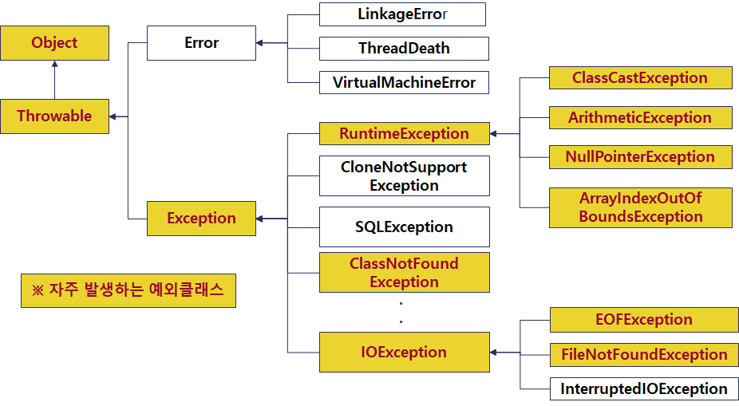

# 예외(Exception) 처리

* 예외란?

  > 프로그램 실행 중에 발생할 수 있는 **예기치 않은 사소한 에러**를 말한다.
  >
  > 치명적인 에러(Memory Full 등)와 달리 프로그램이 종료되어야 할 필요까지는 없는 작은 에러(파일 존재하지 않을 경우, 네트워크 단절 등)를 의미한다.

* 에러와 예외는 다르다.

* JVM(JRE)의 경우 프로그램 실행 중에 사소한 예외가 발생하면 예외 메시지(로그)를 콘솔에 출력한 후 프로그램을 강제 종료하는 기본 메커니즘을 가진다.

* 발생시킨 예외 인스턴스를 개발자가 명시적으로 처리(Handling)하지 않을 경우 JVM은 예외 관련 메시지를 화면에 출력한 후 프로그램을 강제 종료한다.

* 예외 처리의 목적은 "**예외가 발생하더라도 프로그램이 강제 종료 되지 않고**, 사용자와의 상호 작용을 통해 계속 수행되는 견고한 프로그램을 작성"하기 위함.

* 
  * Error 클래스는 주로 하드웨어와 OS 관련된 심각한 에러들을 추상화한 클래스로 개발자가 다루는 예외처리와 관련 없는 클래스이다.
    * 하드디스크 포맷 손상, 메모리 오버플로우 등..
  * Exception에서 RuntimeException정도는 암기하는 게 좋음
  * RuntimeException 클래스 : 실행 시 발생할 수 있는 예외클래스
    * ClassCastException은 형변환 관련 오류가 발생했을 때
    * ArithmeticException은 0으로 나누거나 하는 계산 오류가 발생했을 때
    * NullPointerException은 null을 접근했을 때
    * ArrayIndexOutOfBoundsException은 지정된 인덱스 범위를 벗어나 접근 했을 때
  * 예외 처리 대상은 Error와 RuntimeException 클래스를 제외한 예외클래스이다.
    * 사실 RuntimeException 클래스는 예외 처리 대상이 아님. 실행했을 때만 확인이 가능하기 때문. 따라서 아래에 나온 예제들에서 이 클래스를 이용하는 것은 구문을 확인하기 위해 만든 것일 뿐 실제로는 그렇게 이용하는 것이 아님.
    * RuntimeException은 개발자가 잘못 만든 것.
    * compile checked exception은 나머지 아래쪽을 의미 하는 것.

* 콜스택에 관련된 오류 발생 위치를 저장해 놓는다.


### 예외 직접 처리(try - catch - finally 구문)

``` java
try{
     // 예외가 발생할 가능성이 있는 실행 코드들
     // 주로 입출력, 네트워크처리, 데이터베이스 연동 등
}catch(예외 클래스  매개변수){
     // 예외 처리 코드
} …
catch(Exception  ex){
     // 예외 처리 및 예외 메시지 출력
}finally{
     // 예외가 발생 여부와 관계없이 항상 실행되는 코드
     // 주로 입출력 리소스 해제, 데이터 베이스 연결 종료 등
}
```

* try에서는 예외 발생할 가능성이 있는 실행 코드들을 적는다.

* 그 뒤 catch에서 관련 예외 클래스를 가져온뒤 예외 처리 코드를 실행한다.

  * 이 catch 구문은 switch 구문처럼 여러 개 작성할 수 있다.
  * catch 구문이 실행되는 순간 다른 catch 구문은 확인하지 않는다.

* 그런데 만약 위의 모든 catch 구문에서 못잡으면 마지막에 catch(Exception ex)을 만들어 처리하게 해준다.

  * 이는 상속 구조를 통해 예외를 업캐스팅 해주는 것
  * 마치 switch구문에서 defalut와 비슷한 느낌. 

* finally 블록은 필요에 따라 선택적으로 사용되며, 예외의 발생과 상관없이 무조건 실행되는 블록이다.

  * try 문에서 예외가 발생하는 발생하지 않든 무조건 실행해야 하는 코드들이 있을 때 finally 블록에 넣어준다.
  * finally는 중간에 catch문에서 return;을 만나더라도 무조건 실행되는 블록이다.
  * 다만 catch문에 System.exit(0);을 만나면 JVM이 종료되므로 finally 블록이 실행되지 않는다.

* `try{} finally{}`만 사용하기도 한다.(catch구문 생략)

* 코드 예제 :

  ``` java
  public class Foo {
  
  	public void someMethod() {
  //		String message = null;
  //		System.out.println(message.length()); // 여기서 exception(예외) 발생. new Null... 이 JVM에 의해 만들어지고 실행됨.
  
  //		System.out.println(10/0);
  
  		int[] array = { 1, 2, 3 };
  		System.out.println(array[3]);
  	}
  
  	public void someMethod2() {
  		try {
  		String message = null;
  //		System.out.println(10/0);
  		int[] array = {1,2,3};
  		System.out.println(array[3]);
  		}catch(NullPointerException e) {
  			System.out.println("인스턴스 생성 안 됐음..");
  			System.out.println(e.getMessage());
  			e.printStackTrace();
              return;
  		}catch(ArithmeticException e) {
  //			System.out.println("수학 계산 잘 못했어유..");
  			System.out.println(e.getMessage());
  //			e.printStackTrace();
  		}
  		catch(ArrayIndexOutOfBoundsException e) {
  			System.out.println(e.getMessage());
  //			e.printStackTrace();
  		}
  		catch(Exception e) {
  			System.out.println(e.getMessage());
  		}finally {
  			System.out.println("예외 발생 여부와 상관없이 항상 실행 코드");
  		}
  		
  	}
  
  	public static void main(String[] args) {
  		System.out.println("JVM에 의해 프로그램 시작됨...");
  		Foo foo = new Foo();
  //		foo.someMethod();
  		foo.someMethod2();
  
  		System.out.println("프로그램 종료됨...");
  	}
  }
  ```


### 예외 간접 처리(throws)

* 발생된 예외를 메소드내에서 직접 처리하는 것이 아니라 호출한 메소드에게 발생한 예외 인스턴스를 떠넘겨 간접적으로 처리하는 방법이다.

* 이때 떠넘겨진 곳에서 무조건 예외 처리를 해야한다.

* throws 형식

  ``` java
  public void method() throws 예외 클래스1 [,예외 클래스2,…] {
  	// 예외가 발생할 가능성이 있는 코드
  }
  ```

* 코드 예제 :

  ``` java
  public class Foo {
  	public void someMethod3() throws NullPointerException,ArithmeticException,ArrayIndexOutOfBoundsException{
  		String message = null;
  		System.out.println(message.length());
  		System.out.println(10/0);
  		int[] array = { 1, 2, 3 };
  		System.out.println(array[3]);
  	}
  	
  	public static void main(String[] args) {
  		System.out.println("JVM에 의해 프로그램 시작됨...");
  		Foo foo = new Foo();
  //		foo.someMethod();
  //		foo.someMethod2();
  		try {
              // 만약 someMethod3()에서 throws에서 선언된 예외가 발생하면 
              // 그 즉시 메소드를 종료하고 메소드 실행부분으로 돌아와 
              // 그 메소드 안에서(여기서는 main에서) 실행하도록 한다.
              foo.someMethod3(); 
  		}catch (Exception e) {
  			System.out.println("메인에서 모든 예외 처리 완료.");
  		}
  		System.out.println("프로그램 종료됨...");
  	}
  }
  ```

  실행 결과 :

  ```
  JVM에 의해 프로그램 시작됨...
  메인에서 모든 예외 처리 완료.
  프로그램 종료됨...
  ```

* throws를 이용해 간단한 예외처리로 컴파일 해 확인이 가능하다.

  ``` java
  public static void main(String[] args) throws IOException {
      int value = System.in.read();
  }
  ```

  * 이 예제에서 `System.in.read();`는 기본적으로 `throws IOException`이 선언되어 있는 메소드이다 따라서 예외 처리를 하기 위해 try - catch 문을 이용해야 하지만 대신 간단하게 확인을 하고 싶을 때 main 문에 `throws IOException`를 선언함으로 예외 처리를 정확하게 하지 않고 임시로 확인이 가능하다.


### 예외 인위적 발생(throw)

* 예외는 기본적으로 JVM에 의해 발생하지만, 개발자가 프로그램 로직 상 강제적으로 예외를 발생 시킬 수 있다.

* 형식 :

  ``` java
  throw new 예외클래스();
  ```

* 사용자 정의 예외 클래스

  * 이미 만들어져 있는 예외 클래스들은 일반화 되어 있는 예외 클래스일 뿐.

  * 우리에게 맞춰진 예외가 필요할 수 있다.

  * 관련된 예외 클래스를 만들기 위해 사용자 정의 예외 클래스를 만들어 사용한다.

  * java.lang.Exception 클래스를 확장하여 만든다.

  * 코드 예제 :

    ``` java
    public class InsufficientBalanceException extends Exception{
        public InsufficientBalanceException(String msg){
            super(msg);
        }
    }
    ```


### TryWithCatch 구문

* 파일 입출력 같은 클래스를 사용할 때는 파일 입출력한 클래스의 메모리 누수를 방지하기 위해 마지막에 `close()` 해주어야 한다.

* 그래서 원래 try catch 구문에서는 finally 구문에 `close()`를 추가해 주었지만 이를 자동으로 해주는 구문이 자바 1.7에 추가되었다.

* 코드 예제

  ``` java
  try(InputStream in = new FileInputStream("example.dat")){
      System.out.println(in.read());
  } catch (Exception e){
  	e.printStackTrace();
  }
  ```

  * 위처럼 try 옆에 메소드를 사용하는 것처럼 괄호를 연 뒤 닫을 필요가 있는 클래스를 적어두면 try문 안에 있는 것까지 포함해 자동으로 클래스들을 닫아주게 된다.