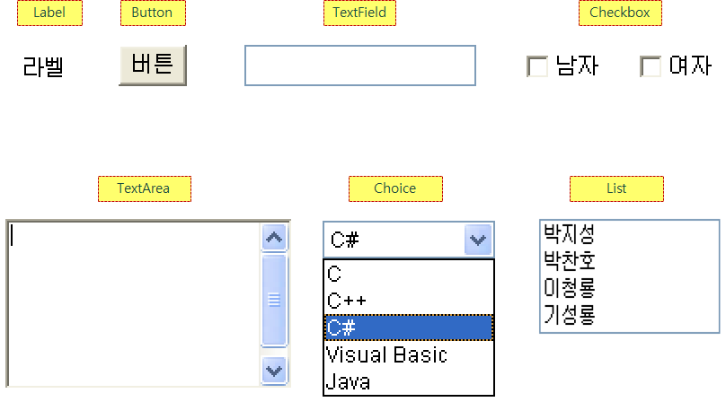
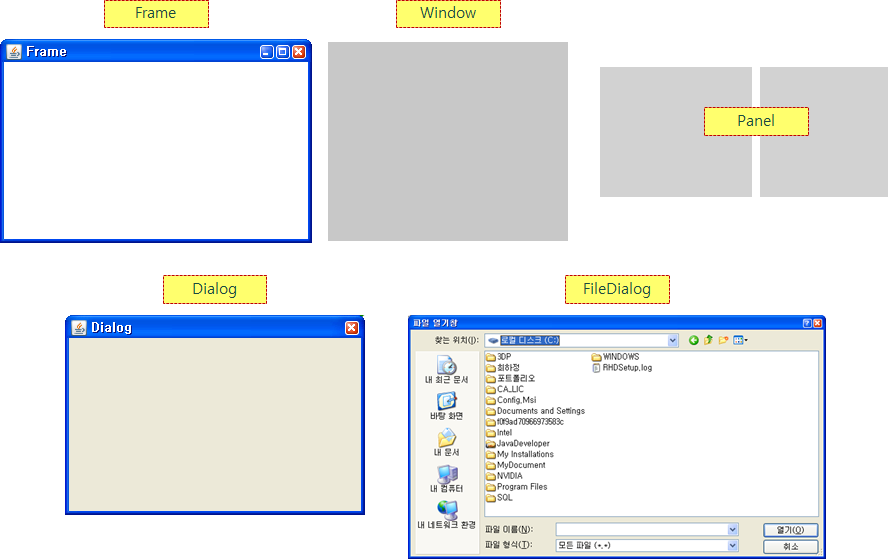
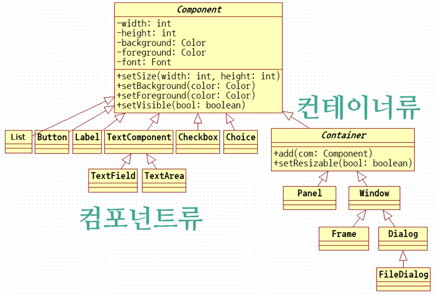
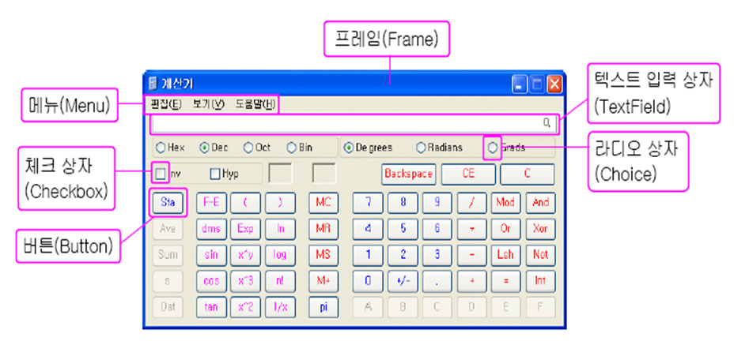
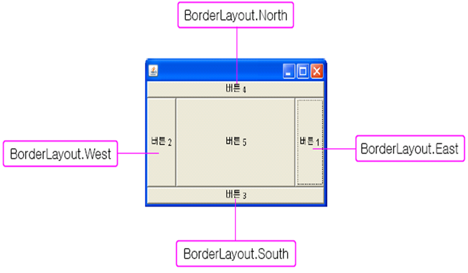
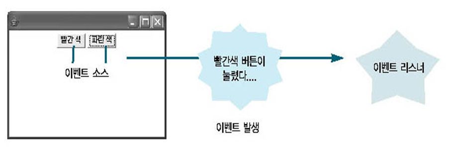

# GUI 프로그래밍

## AWT API를 이용한 GUI 프로그래밍

#### AWT API 소개

* AWT : Abstract Window Toolkit

* GUI(Graphic User Interface) Application를 개발하는데 필요한 기본적인 클래스와 인터페이스들을 제공한다.

  * 패키지 : java.awt; java.awt.event;

* AWT API 특징

  * 운영체제(Window, Unix, Mac)가 제공하는 그래픽 리소스(자원) 사용하기 때문에 실행중인 운영체제에 따라 보여지는 화면이 다르다
  * 이름에 Abstract가 들어가는 이유가 운영체제에 따라 보여지는 모습이 다르기 때문에.

* AWT API 분류

  * Visual Component 류

    

    * Button, Label, TextField, TextArea, Checkbox, List, Choice 클래스 등…

  * Container 류 : 각각의 컴포넌트들을  배치하기 위한 컴포넌트들

    

    * Window, Frame, Dialog, FileDialog, Panel 등

* AWT 패키지 상속 구조

  
  * Component는 추상클래스이다.
  * 실제로는 이것보다 더 많은 속성과 메소드들이 있지만 이해를 돕기 위해 몇개를 적어 놓았다.
  * 컨테이너류의 Window는 아무것도 없는 화면이다.
  * 이를 상속 받는 Frame은 거기에 상단바와 최소,최대,종료 버튼, 보더까지 추가되어있다.

* AWT를 이용한 GUI 샘플

  

* 코드 예제 1

  ``` java
  import java.awt.Button;
  import java.awt.Checkbox;
  import java.awt.CheckboxGroup;
  import java.awt.Choice;
  import java.awt.FlowLayout;
  import java.awt.Frame;
  import java.awt.Label;
  import java.awt.TextArea;
  import java.awt.TextField;
  
  public class AWTExample {
  
  	public static void main(String[] args) {
  
          // 가장 먼저 프레임으로 컴포넌트들으을 넣을 공간 만들기
  		Frame frame = new Frame("처음으로 만든 프레임");
  		frame.setSize(600, 500);
  		frame.setVisible(true);
  		
          // 버튼 만들기
  		Button button1 = new Button("AWT 버튼1");
  		Button button2 = new Button("AWT 버튼2");
  		
  		// FlowLayout()은 글자를 적어나가는 것처럼
  		// 계속 오른쪽으로 이어나가다 가득 차면 다음 줄로 넘어가는 방법
  		frame.setLayout(new FlowLayout());
          
          // 프레임에 만들었던 버튼 추가
  		frame.add(button1);
  		frame.add(button2);
  		
  		Label label = new Label("AWT Label");
  		frame.add(label);
  		
  		TextField textField = new TextField("ID", 10);
  		frame.add(textField);
  		
  		TextArea textArea = new TextArea(5, 30);
  		frame.add(textArea);
  	
  		Checkbox checkbox = new Checkbox("남자", true);
  		frame.add(checkbox);
  		
  		// 라디오 버튼 만드는 것. 그룹을 먼저 만들고 그룹안에 체크박스를 넣는 것.
  		CheckboxGroup cg = new CheckboxGroup();
  		Checkbox cb1 = new Checkbox("Male",true,cg);
  		Checkbox cb2 = new Checkbox("Female",false,cg);
  		frame.add(cb1);
  		frame.add(cb2);
  		
  		Choice selectBox = new Choice();
  		selectBox.add("박지성");
  		selectBox.add("박찬호");
  		selectBox.add("박찬숙");
  		frame.add(selectBox);
  		
  //		frame.setResizable(false);
  	}
  
  }
  ```

  * 이렇게 짜는 건 C스타일
  * main 문에서 모든걸 만들기 때문

* 코드 예제 2

  ``` java
  import java.awt.Button;
  import java.awt.Frame;
  
  public class UserFrame extends Frame {
  	Button button;
  
  	public UserFrame(){
  		this("이름없음");
  	}
  	public UserFrame(String title) {
  		super(title);
  		this.button = new Button("Buttons....");
  	}
  	
  	// 화면 배치 기능
  	public void setContents() {
  		add(button);
  	}
  	
  	public static void main(String[] args) {
  		UserFrame frame = new UserFrame("윈도우 타이틀");
  		frame.setContents();
  		frame.setSize(1000, 800);
  		frame.setVisible(true);
      }
  }
  ```


## Component 클래스의 주요 메소드

- Color 클래스 안에서는 기본적으로 설정해 놓은 색상들이 상수로 만들어져 있음

  - 내가 원하는 색을 rgb로 만들고 싶다면 `new Color(int r, int g, int b)`로 만들어주면 된다.

- | 생성자                                       |                                |
  | -------------------------------------------- | ------------------------------ |
  | Component ( )                                |                                |
  | 메서드                                       |                                |
  | public void add(PopupMenu pop)               | 컴포넌트에 팝업 메뉴 추가      |
  | public Color getBackground()                 | 컴포넌트 배경색 반환           |
  | public Color getForeground()                 | 컴포넌트 전경색 반환           |
  | public Graphics getGraphics()                | 컴포넌트 Graphic 객체 반환     |
  | public String getName()                      | 컴포넌트 이름 반환             |
  | public Container getParent()                 | 부모 컨테이너 반환             |
  | public Dimension getSize()                   | 컴포넌트 크기 반환             |
  | public boolean isEnabled()                   | 컴포넌트 활성 여부 반환        |
  | public boolean isVisible()                   | 컴포넌트 화면 보이기 여부 반환 |
  | public void remove(MenuComponent com)        | 팝업 메뉴 제거                 |
  | public void repaint()                        | 컴포넌트 다시 그리기           |
  | public setBackground(Color color)            | 컴포넌트 바탕색 지정           |
  | public setEnabled(boolean b)                 | 컴포넌트 활성 여부 지정        |
  | public setFont(Font f)                       | 컴포넌트 폰트 설정             |
  | public setLocation(int x, int y)             | 컴포넌트 위치 설정             |
  | public setSize(int w, int h)                 | 컴포넌트 크기 설정             |
  | public setBounds(int x, int y, int w, int h) | 컴포넌트 위치와 크기 설정      |
  | public setVisible(boolean b)                 | 컴포넌트 화면에 보이도록 설정  |

  - 코드 예제

    ```java
    import java.awt.BorderLayout;
    import java.awt.Button;
    import java.awt.Color;
    import java.awt.Component;
    import java.awt.Container;
    import java.awt.Dimension;
    import java.awt.Font;
    import java.awt.Frame;
    import java.awt.Label;
    import java.awt.List;
    import java.awt.Panel;
    import java.awt.TextArea;
    import java.awt.TextField;
    import java.awt.Toolkit;
    
    public class ChatFrame extends Frame {
    	Label serverLabel;
    	TextField serverTF, inputTF;
    	Button connectB, sendB;
    	TextArea messageTA;
    	List userList;
    
    	public ChatFrame() {
    		this("이름없음");
    	}
    
    	public ChatFrame(String title) {
    		super(title);
    		serverLabel = new Label("서버");
    		serverTF = new TextField();
    		inputTF = new TextField();
    		connectB = new Button("연결");
    		sendB = new Button("전송");
    		messageTA = new TextArea();
    		userList = new List();
    	}
    
    	// 화면 배치
    	public void setContents() {
    		// 폰트 지정 메소드
    		connectB.setFont(new Font("궁서", Font.BOLD, 20));
    		
    		Panel northP = new Panel();
    		northP.setLayout(new BorderLayout());
    		northP.add(serverLabel, BorderLayout.WEST);
    		northP.add(serverTF, BorderLayout.CENTER);
    		northP.add(connectB, BorderLayout.EAST);
    
    		Panel southP = new Panel(new BorderLayout());
    		southP.add(inputTF, BorderLayout.CENTER);
    		southP.add(sendB, BorderLayout.EAST);
    
    		add(northP, BorderLayout.NORTH);
    		add(messageTA, BorderLayout.CENTER);
    		add(userList, BorderLayout.EAST);
    		add(southP, BorderLayout.SOUTH);
    
    		// 버튼 활성화/비활성화 버튼
    //		connectB.setEnabled(false);
    		
    		// 배경화면 색 지정
    //		connectB.setBackground(new Color(255, 0, 255));
    //		connectB.setBackground(Color.BLUE);
    //		connectB.setForeground(Color.WHITE);
    //		setColorAll(Color.RED); // 메소드를 만들어 한번에 모든 배경 색 지정
    		
    	}
    	
        // 화면의 정중앙에 위치시키는 기능
    	public void setCenter() {
    //		Runtime.getRuntime().exec(command);
    		Toolkit.getDefaultToolkit().beep();
    		Dimension dim = Toolkit.getDefaultToolkit().getScreenSize();
    		
    		int width = (int) ((dim.getWidth()-this.getWidth())/2);
    		int height = (int) ((dim.getHeight() - getSize().getHeight())/2);
            // Component의 빌트인 메소드. 위치 지정.
    		setLocation(width, height);
    	}
    	
        // 모든 버튼들에 배경 색을 지정하는 기능
    	private void setColorAll(Color bg) {
    		Component[] components = getComponents();
    		for (Component component : components) {
    			if(component instanceof Panel) {
    				Component[] cs = ((Panel) component).getComponents();
    				for (Component component2 : cs) {
    					component2.setBackground(bg);
    					component.setForeground(Color.WHITE);
    				}
    			}
    			component.setBackground(bg);
    		}
    	}
    
    	public static void main(String[] args) {
    		ChatFrame frame = new ChatFrame("Kotalk");
    		frame.setContents();
    		frame.setSize(400, 500);
    		frame.setCenter();
    		frame.setVisible(true);
    	}
    
    }
    ```

- 우리가 만들고자 하는 화면을 Frame 클래스를 상속받아 만드는 것보다는 Panel을 상속받아 만드는 것이 다른 곳에 응용하기 좋다.

  - 우리가 만든 채팅창을 다른 화면 안에 넣고 싶을 때 Frame을 상속받아 만든 것이면 넣을 수 가 없다.

  - 하지만 우리가 Panel로 채팅창을 만들었다면 다른 화면(Frame)에 우리의 Panel을 넣어주기만 하면 된다.

  - 코드 예제

    ```java
    import java.awt.BorderLayout;
    import java.awt.Button;
    import java.awt.Frame;
    import java.awt.GridLayout;
    import java.awt.Panel;
    
    public class GridPanel extends Panel {
    	Button[] buttons;
    	
    	public GridPanel() {
    		buttons = new Button[100];
    		for (int i = 0; i < buttons.length; i++) {
    			buttons[i] = new Button(i + "Button");
    			add(buttons[i]);
    		}
    		setLayout(new GridLayout(10, 10));
    	}
    
    	public static void main(String[] args) {
    		Frame frame = new Frame("GridLayout Example");
    
    		GridPanel gridPanel =  new GridPanel();
    		frame.add(gridPanel, BorderLayout.CENTER);
    		frame.setSize(400,400);
    		frame.setVisible(true);
    		
    	}
    }
    ```


### LayoutManger

#### 1. FlowLayout

* 물로 흘러가듯이 오른쪽에 차근차근 붙어서 레이아웃이 구성됨
* 한 줄에 가득 차면 다음줄로 넘어가 다시 채워나감.


#### 2. BorderLayout



* 이건 5개의 영역으로만 나뉘어 질 수 있는 것.
* 이걸 왜 쓰나 생각이 들 수 있지만 이건 동적으로 영역 크기가 변경됨.
* 지금 버튼으로 되어 있는 영역을 패널로 바꾸면 좀 더 이쁘게 꾸밀 수 있을 것.
* 예를 들어 카카오톡에서 채팅창과 아래 채팅 치는 영역만 있다고 생각해볼때 center를 채팅창 영역으로 만들고 South를 채팅 치는 영역으로 하면 된다.
  ``` java
  import java.awt.BorderLayout;
  import java.awt.Button;
  import java.awt.Frame;
  import java.awt.Label;
  import java.awt.List;
  import java.awt.Panel;
  import java.awt.TextArea;
  import java.awt.TextField;
  
  public class ChatFrame extends Frame {
      Label serverLabel;
      TextField serverTF, inputTF;
      Button connectB, sendB;
      TextArea messageTA;
      List userList;
  
      public ChatFrame() {
          this("이름없음");
      }
  
      public ChatFrame(String title) {
          super(title);
          serverLabel = new Label("SERVER");
          serverTF = new TextField();
          inputTF = new TextField();
          connectB = new Button("CONNECT");
          sendB = new Button("SEND");
          messageTA = new TextArea();
          userList = new List();
  
      }
  
      // 화면 배치
      public void setContents() {
          // 패널 안에 여러 가지 원하는 component를 넣어 놓은 것
          Panel northP = new Panel();
          northP.setLayout(new BorderLayout());
          northP.add(serverLabel, BorderLayout.WEST);
          northP.add(serverTF, BorderLayout.CENTER);
          northP.add(connectB, BorderLayout.EAST);
  
          Panel southP = new Panel(new BorderLayout());
          southP.add(inputTF, BorderLayout.CENTER);
          southP.add(sendB, BorderLayout.EAST);
  
          // 위에서 만든 패널과 함께 기본 BorderLayout에 넣는 것.
          add(northP,BorderLayout.NORTH);
          add(messageTA,BorderLayout.CENTER);
          add(userList,BorderLayout.EAST);
          add(southP,BorderLayout.SOUTH);
  
      }
  
      public static void main(String[] args) {
          ChatFrame frame = new ChatFrame("Kotalk");
          frame.setContents();
          frame.setSize(400, 500);
          frame.setVisible(true);
      }
  }
  ```


#### 3. GridLayout

#### 4. GridBagLayout

* 기본적으로 GridBagLayout은 화면 안에 그리드를 만들고 그 그리드 안에 우리가 원하는 컴포넌트들을 집어 넣는 구조.
* gridx, gridy 격자 위치 지정.

* gridwidth 는 옆으로 몇 칸을 합쳐서 차지하는 수, gridheight 는 아래로 몇 칸을 합쳐서 차지하는지 정하는 수

  * 주의사항으로는 여기에 남는 공간이 있을 때 그 공간만큼 차지할 수 있는 것이고, 없으면 차지하지 못한다.
  * 예로 첫 줄에 첫 그리드를 추가할 때 gridwidth를 아무리 크게 줘도 실제로 그리드는 1개만이 만들어진다.
  * 또한 이렇게 만들어진 그리드는 행으로 크기와 개수를 공유하게 된다.
  * 위의 이유로 가로로 여러칸을 차지하는 그리드를 만들고 싶다면 다른 행에서 그런 공간을 차지할 수 있는 그리드를 추가해주거나 해야 한다.

* 우리가 실제로 GridBagLayout을 만들 때 만들어야 하는 속성이 너무 많아 GridBagConstraints 라는 클래스 안에 관련된 정보를 저장해 놓는다.

* GridBagConstraints 클래스 안에 weightx, weighty 라는 변수가 존재한다.

  * weightx,y를 지정해주지 않았을 때는 우리가 만든 프레임 안에 grid가 생기고 그 크기는 컴포넌트 크기만을 차지한다.

  * 이때는 우리가 화면을 늘리거나 줄이더라도 변화를 얻을 수 없다.

  * 하지만 우리는 동적으로 화면에서 차지하는 범위를 지정하고 싶을 수 있다.

  * 이때 사용하는 변수가 weightx,y 이다.

  * 이 변수가 없을 때는 grid들이 여백을 따로 차지하지 않는다.

  * 그런데 weightx,y를 정해주게 되면 grid가 여백을 지정한 만큼 비율로 차지하게 된다.

  * 예) grid가 각각 `weightx = 1` 을 가지고 있다고 해보자. 그럼 각각의 그리드는 다음처럼 
    $$
    \dfrac{그리드1 \; weightx}{그리드1 \; weightx + 그리드2 \; weightx}
    $$
    만들어 지게 된다. 따라서 각각의 그리드가 화면 여백을 절반씩 차지하게 될 것이다.

    만약 그리드 2의 weightx가 2라면 그리드 2는 화면 여백을 66.6%(2/3)만큼 차지하게 될 것이다.

  * 위의 경우엔 그리드가 2개 뿐이지만 여러개의 그리드가 존재할 때 각각의 그리드의 모든 웨이트 값을 합친 값을 분모로 하게 되고 자신의 값을 분자로 받아 비율을 계산하게 된다.

* GridBagConstraints 클래스 안에 fill 이라는 변수가 존재함.

  * 이 변수는 그리드 안에 컴포넌트가 그리드를 꽉채울지 결정하는 것.

  * `gridBagConstraints.fill = GridBagConstraints.HORIZONTAL;` 이나

    `gridBagConstraints.fill = GridBagConstraints.VERTICAL;`을 이용해 각각 수평으로 가득 채울지 수직으로 가득 채울지 정한다.

  * 만약 수평, 수직으로 모두 가득 채우고 싶다면 `GridBagConstraints.BOTH`를 사용하면 된다.

* 코드 예제

  ``` java
  // 메일 보내는 화면
  import java.awt.Button;
  import java.awt.Component;
  import java.awt.FlowLayout;
  import java.awt.Frame;
  import java.awt.GridBagConstraints;
  import java.awt.GridBagLayout;
  import java.awt.Insets;
  import java.awt.Label;
  import java.awt.Panel;
  import java.awt.TextArea;
  import java.awt.TextField;
  
  public class Practice extends Panel {
  	Button searchB, sendB, cancleB;
  	TextField receiverTF, fileTF, titleTF, mainTF;
  	TextArea mainTA;
  	Label receiverL, fileL, titleL, blankL;
  	GridBagLayout bagLayout;
  	GridBagConstraints bagConstraints;
  	Panel buttonsP, searchP;
  
  	public Practice() {
  		searchB = new Button("찾기");
  		sendB = new Button("보내기");
  		cancleB = new Button("취 소");
  		receiverTF = new TextField();
  		fileTF = new TextField();
  		titleTF = new TextField();
  		mainTA = new TextArea();
  		mainTF = new TextField();
  		receiverL = new Label("받는사람");
  		fileL = new Label("첨부파일");
  		titleL = new Label("제목");
  		bagLayout = new GridBagLayout();
  //		bagConstraints = new GridBagConstraints();
  		blankL = new Label();
  		buttonsP = new Panel();
  		searchP = new Panel(new FlowLayout(FlowLayout.LEFT));
  	}
  
  	public void setContents() {
  		setLayout(bagLayout);
  
  		setCon(0, 0, 1, 1, 0, 0);
  		setCon2(false, false, new Insets(5, 10, 5, 0));
  		bagLayout.setConstraints(receiverL, bagConstraints);
  		add(receiverL);
  
  //		bagConstraints.fill = GridBagConstraints.HORIZONTAL;
  //		gridBagConstraints.insets = new Insets(5,5,5,5);
  //		bagLayout.setConstraints(searchB, bagConstraints);
  //		add(searchB);
  		setCon(1, 0, 1, 1, 2, 0);
  		setCon2(true, false, new Insets(5, 0, 5, 0));
  		bagLayout.setConstraints(receiverTF, bagConstraints);
  		add(receiverTF);
  
  		setCon(2, 0, 1, 1, 1, 0);
  		bagLayout.setConstraints(blankL, bagConstraints);
  		add(blankL);
  
  		setCon(0, 1, 1, 1, 0, 0);
  		setCon2(false, false, new Insets(5, 10, 5, 0));
  		bagLayout.setConstraints(fileL, bagConstraints);
  		add(fileL);
  
  		setCon(1, 1, 1, 1, 2, 0);
  		setCon2(true, false, new Insets(5, 0, 5, 0));
  		bagLayout.setConstraints(fileTF, bagConstraints);
  		add(fileTF);
  
  		searchP.add(searchB);
  		setCon(2, 1, 1, 1, 1, 0);
  		setCon2(true,false,null);
  		bagLayout.setConstraints(searchP, bagConstraints);
  		add(searchP);
  
  		setCon(0, 3, 1, 1, 0, 0);
  		setCon2(false, false, new Insets(5, 10, 5, 0));
  		bagLayout.setConstraints(titleL, bagConstraints);
  		add(titleL);
  
  		setCon(1, 3, 2, 1, 1, 0);
  		setCon2(true, false, new Insets(5, 0, 5, 10));
  		bagLayout.setConstraints(titleTF, bagConstraints);
  		add(titleTF);
  
  		setCon(0, 4, 3, 10, 1, 1);
  		setCon2(true, true, new Insets(10, 10, 10, 10));
  		bagLayout.setConstraints(mainTA, bagConstraints);
  		add(mainTA);
  		
  		buttonsP.add(sendB);
  		buttonsP.add(cancleB);
  		setCon(0,14,3,1,1,0);
  		setCon2(true,true,new Insets(0,0,10,0));
  		bagLayout.setConstraints(buttonsP, bagConstraints);
  		add(buttonsP);
  
  	}
  
  	private void setCon(int gridx, int gridy, int gridwidth, int gridheight, double weightx, double weighty) {
  		bagConstraints = new GridBagConstraints();
  		bagConstraints.gridx = gridx;
  		bagConstraints.gridy = gridy;
  		bagConstraints.gridwidth = gridwidth;
  		bagConstraints.gridheight = gridheight;
  		bagConstraints.weightx = weightx;
  		bagConstraints.weighty = weighty;
  	}
  
  	private void setCon2(boolean hori, boolean verti, Insets insets) {
  		if (hori && verti) {
  			bagConstraints.fill = GridBagConstraints.BOTH;
  		}else if (hori) {
  			bagConstraints.fill = GridBagConstraints.HORIZONTAL;
  		}else if (verti) {
  			bagConstraints.fill = GridBagConstraints.VERTICAL;
  		}
  		if (insets != null) {
  			bagConstraints.insets = insets;
  		}
  	}
  
  	public static void main(String[] args) {
  		Frame frame = new Frame("Pactice!!");
  
  		Practice practice = new Practice();
  		practice.setContents();
  
  		frame.add(practice);
  		frame.pack();
  		frame.setVisible(true);
  	}
  }
  ```


#### 5. CardLayout

* 화면을 겹쳐놓고 원하는 것을 보여주는 것

* 카드 패널을 이용해서 여러 패널들을 보여주는 방법

  ``` java
  Panel cardPanel;
  CardLayout cardLayout;
  
  cardPanel.setLayout(cardLayout);
  cardPanel.add("LOGIN", loginPanel);
  cardPanel.add("MAIN", mainPanel);
  
  add(cardPanel, BorderLayout.CENTER);
  ```

  * 먼저 패널을 만든 뒤 `setLayout()`을 통해 CardLayout 으로 레이아웃을 설정해준다.
  * 그 뒤 자신이 사용하고자 하는 패널들을 추가해주고
  * `add()`를 통해 CardLayout으로 레이아웃이 설정된 패널을 보여주면 된다.

* 코드 예제

  ``` java
  import java.awt.BorderLayout;
  import java.awt.Button;
  import java.awt.CardLayout;
  import java.awt.Color;
  import java.awt.Component;
  import java.awt.Dimension;
  import java.awt.FlowLayout;
  import java.awt.Font;
  import java.awt.Frame;
  import java.awt.Label;
  import java.awt.List;
  import java.awt.Panel;
  import java.awt.TextArea;
  import java.awt.TextField;
  import java.awt.Toolkit;
  
  /**
   * CardLayout 적용 Frame
   * @author 김기정
   *
   */
  public class TalkFrame extends Frame {
  	
  	LoginPanel loginPanel;
  	MainPanel mainPanel;
  	
  	Panel cardPanel;
  	CardLayout cardLayout;
  	
  	
  	public TalkFrame() {
  		this("이름없음");
  	}
  	
  	public TalkFrame(String title) {
  		super(title);
  		loginPanel = new LoginPanel(this);
  		mainPanel = new MainPanel(this);
  		
  		cardPanel = new Panel();
  		cardLayout = new CardLayout();
  		
  	}
  
  	// 화면 배치
  	public void setContents() {
  		cardPanel.setLayout(cardLayout);
  		cardPanel.add("LOGIN", loginPanel);
  		cardPanel.add("MAIN", mainPanel);
  		
  		add(cardPanel, BorderLayout.CENTER);
  		
  //		cardLayout.show(cardPanel, "MAIN");
  		
  	}
  	
  	public void setCenter() {
  		//Runtime.getRuntime().exec(command);
  		Toolkit.getDefaultToolkit().beep();
  		Dimension dim = Toolkit.getDefaultToolkit().getScreenSize();
  		
  		int x = (dim.width - getSize().width)/2;
  		int y = (dim.height - getSize().height)/2;
  		setLocation(x, y);
  	}
  	
  	public void changeCard(String name) {
  		cardLayout.show(cardPanel, name);
  	}
  	
  	public static void main(String[] args) {
  		TalkFrame frame = new TalkFrame("Kotalk");
  		frame.setContents();
  		frame.setSize(300, 500);
  		frame.setCenter();
  		frame.setVisible(true);
  	}
  
  }
  ```

  ``` java
  import java.awt.Button;
  import java.awt.Component;
  import java.awt.Frame;
  import java.awt.GridBagConstraints;
  import java.awt.GridBagLayout;
  import java.awt.Insets;
  import java.awt.Label;
  import java.awt.Panel;
  import java.awt.TextField;
  import java.awt.event.ActionEvent;
  import java.awt.event.ActionListener;
  import java.awt.event.MouseEvent;
  import java.awt.event.MouseListener;
  
  public class LoginPanel extends Panel  implements ActionListener {
  	TalkFrame talkFrame;
  	GridBagLayout gridBagLayout;
  	GridBagConstraints gridBagConstraints;
  	
  	Label emailL, passwdL;
  	TextField emailTF, passwdTF;
  	Button loginB, registB;
  	
  	public LoginPanel(TalkFrame talkFrame) {
  		gridBagLayout = new GridBagLayout();
  		gridBagConstraints = new GridBagConstraints();
  		
  		emailL = new Label("EMAIL");
  		passwdL = new Label("PASSWD");
  		emailTF = new TextField();
  		passwdTF = new TextField();
  		passwdTF.setEchoChar('*');
  		loginB = new Button("LOGIN");
  		registB = new Button("REGIST");
  		setContents();
  		
  		this.talkFrame = talkFrame;
  		loginB.addActionListener(this);
  	}
  	
  	private void add(Component component, int gridx, int gridy, int gridwidth, int gridheight, double weightx, double weighty) {
  		gridBagConstraints.gridx = gridx;
  		gridBagConstraints.gridy = gridy;
  		gridBagConstraints.gridwidth = gridwidth;
  		gridBagConstraints.gridheight = gridheight;
  		gridBagConstraints.weightx = weightx;
  		gridBagConstraints.weighty = weighty;
  		gridBagConstraints.fill = gridBagConstraints.HORIZONTAL;
  		gridBagConstraints.insets = new Insets(4, 1, 4, 1);
  		
  		gridBagLayout.setConstraints(component, gridBagConstraints);		
  		add(component);
  	}
  	
  	public void setContents() {
  		setLayout(gridBagLayout);
  		add(new Label(" "),   0, 0, 1, 1, 0, 0);
  		add(emailL,   1, 0, 1, 1, 0, 0);
  		add(emailTF,  2, 0, 1, 1, 1, 0);
  		add(new Label(" "), 3, 0, 1, 1, 0, 0);
  		
  		add(new Label(" "),   0, 1, 1, 1, 0, 0);
  		add(passwdL,  1, 1, 1, 1, 0, 0);
  		add(passwdTF, 2, 1, 1, 1, 1, 0);
  		add(new Label(" "),   3, 1, 1, 1, 0, 0);
  		
  		Panel buttonPanel = new Panel();
  		buttonPanel.add(loginB);
  		buttonPanel.add(registB);
  		add(buttonPanel, 0, 2, 3, 1, 0, 0);
  		
  	}
  	
  	@Override
  	public void actionPerformed(ActionEvent e) {
  //		talkFrame.cardLayout.show(talkFrame.cardPanel, "MAIN");
  		talkFrame.changeCard("MAIN");
  	}
  
  }
  ```


## AWT 컴포넌트의 이벤트 처리

* 이벤트(Event) 란?

  > 프로그램과 사용자 간의 상호작용을 위해서 사용자가 키보드나 마우스 등의 장치를 통해서 응용프로그램에 어떤 요구를 하는 사건을 말한다.

* 이벤트 소스(Source) 란?

  > 버튼(Button)이나 텍스트 입력 상자(TextField)와 같이 이벤트가 발생한 컴포넌트 인스턴스를 말한다.

  

  * 우리가 버튼을 클릭하면 어떤 관련된 이벤트 객체가 메모리에 생성된다.
  * 그럼 우린 이벤트 객체를 메모리에서 받아와 사용해야 하는데 이를 인터페이스를 통해 받아들여 처리할 것이다.
  * JVM에서 우리가 마우스 클릭을 하면 관련 마우스 이벤트 객체가 메모리에 생성되고 이를 처리하는 과정을 만나게 되면 JVM에서 관련 메소드에 마우스 이벤트 객체 값을 자동으로 입력해준다.
    * 이렇게 자동으로 실행되는 메소드를 **Call back 메소드**라 한다.

* 사용자가 처리하는 이벤트도 있고 시스템이 처리하는 이벤트도 있다.

* 이벤트 리스너를 만드는 3가지 방법이 있다.

  * 화면을 구현한 클래스 안에서 바로 리스너를 구현해서 처리하는 방법

    ``` java
    public class xxxFrame extends Frame implements MouseListener {
        ...
    }
    ```

  * 화면을 구현한 클래스 밖에 리스너를 구현해서 사용하는 방법

    ``` java
    public class xxxFrame extends Frame {
        ...
    }
    public class MouseHandle implements MouseListener {
        ...
    }
    ```

  * 이벤트 리스너를  화면 클래스 안에 내부 클래스로 구현해서 사용하는 방법

    * 내부 클래스는 그 클래스 말고 다른 클래스에서도 사용할 수 있다.

* 코드 예제 1

  ``` java
  // 이 예제는 화면을 구현한 클래스 내에서 바로 리스너를 구현하는 예제
  
  import java.awt.BorderLayout;
  import java.awt.Button;
  import java.awt.Color;
  import java.awt.FlowLayout;
  import java.awt.Frame;
  import java.awt.event.MouseEvent;
  import java.awt.event.MouseListener;
  import java.awt.event.WindowEvent;
  import java.awt.event.WindowListener;
  
  public class UserFrame extends Frame implements MouseListener, WindowListener {
  	Button eButton, wButton, nButton, sButton, cButton;
  
  	public UserFrame() {
  		this("이름없음");
  	}
  
  	public UserFrame(String title) {
  		super(title);
  		this.eButton = new Button("EAST");
  		this.wButton = new Button("WEST");
  		this.nButton = new Button("NORTH");
  		this.sButton = new Button("SOUTH");
  		this.cButton = new Button("CENTER");
  	}
  
  	// 화면 배치 기능
  	public void setContents() {
  		// 레이아웃매니저 교체
  		setLayout(new FlowLayout());
  		add(eButton, BorderLayout.EAST);
  		add(wButton, BorderLayout.WEST);
  		add(nButton, BorderLayout.NORTH);
  		add(sButton, BorderLayout.SOUTH);
  		add(cButton, BorderLayout.CENTER);
  	}
  
  	public void eventRegist() {
  		// 이벤트 소스에 이벤트리스너 연결
  		eButton.addMouseListener(this);
  		wButton.addMouseListener(this);
  		nButton.addMouseListener(this);
  		sButton.addMouseListener(this);
  		cButton.addMouseListener(this);
  		addWindowListener(this);
  	}
  
  	@Override
  	public void mouseClicked(MouseEvent e) {
  		// 마우스를 클릭할 때 실행되는 메소드
  		System.out.println("mouseClicked() Called...");
  		Object eventSource = e.getSource();
  		
  		if (eventSource == eButton) {
  			System.out.println("East Clicked...");
              // 버튼 클릭시 버튼배경색을 랜덤하게 바꾸는 코드
              Button button = (Button) eventSource;
              int r = (int) (Math.random() * 256);
              int g = (int) (Math.random() * 256);
              int b = (int) (Math.random() * 256);
              button.setBackground(new Color(r, g, b));
              } else if (eventSource == wButton) {
                  System.out.println("West Clicked...");
              } else if (eventSource == sButton) {
                  System.out.println("South Clicked...");
              } else if (eventSource == nButton) {
                  System.out.println("North Clicked...");
              } else if (eventSource == cButton) {
                  System.out.println("Center Clicked...");
              }
  	}
  
  	@Override
  	public void mousePressed(MouseEvent e) {
  		// 마우스를 누르고 있을 때
  		System.out.println("mousePressed() Called...");
  	}
  
  	@Override
  	public void mouseReleased(MouseEvent e) {
  		// 마우스를 누르고 있다 땔 때
  		System.out.println("mouseReleased() Called...");
  	}
  
  	@Override
  	public void mouseEntered(MouseEvent e) {
  		// 마우스가 영역에 들어오면 실행되는 메소드
  		System.out.println("mouseEntered() Called...");
  	}
  
  	@Override
  	public void mouseExited(MouseEvent e) {
  		// 마우스가 영역에서 빠져나갈 때 실행
  		System.out.println("mouseExited() Called...");
  	}
  
  	@Override
  	public void windowOpened(WindowEvent e) {
  		// 창이 열릴 때 하고 싶은 작업들이 있을 때.
  		System.out.println("창이 열렸습니다.");
  	}
  
  	@Override
  	public void windowClosing(WindowEvent e) {
  		// 윈도우 창 종료 버튼 입력할 때
  		setVisible(false);
  		dispose(); // AWT는 OS로부터 그래픽 리소스를 얻어와 사용하는데 이를 반납해주는 메소드
  		System.exit(0);
  	}
  
  	@Override
  	public void windowClosed(WindowEvent e) {
  		// 자원 반납이 다 되면 이 메소드가 호출이 됨.
          // 자원 반납이 잘 되었는지 확인하려면 사용하면 된다.
  	}
  
  	@Override
  	public void windowIconified(WindowEvent e) {
  		// 다시 최소화를 풀 때 
  	}
  
  	@Override
  	public void windowDeiconified(WindowEvent e) {
  		// 최소화 시켜 아이콘화 시킬 때 
  	}
  
  	@Override
  	public void windowActivated(WindowEvent e) {
  		// 윈도우 창이 다른 것에 가려져 있다가 다시 활성화 될때 할 것들
  	}
  
  	@Override
  	public void windowDeactivated(WindowEvent e) {
  		// 창이 비활성화 될 때
  	}
      
      public static void main(String[] args) {
  		UserFrame frame = new UserFrame("윈도우 타이틀");
  		frame.setContents();
  		frame.eventRegist();
  		frame.setSize(500, 500);
  		frame.setVisible(true);
  	}
  }
  ```


* 이벤트 소스

  * 어디선가 생기는 이벤트의 소스
* 이벤트리스너(핸들러)

  * 이벤트 소스에서 발생하는 다양한 이벤트들 중 필요한 것들을 처리하기 위한 리스너
* 이벤트소스에 리스너 연결(등록)

  * 이벤트 소스에 이벤트리스너를 연결해주는 활동

* Event별 Adapter 클래스

  * EventListener 인터페이스의 경우 불필요한 메서드까지 Overriding 해야 하는 단점(멍텅구리 메서드 양산)을 극복하고자 해서 나온 클래스가 어댑터 클래스이다.
  * 리스너 인터페이스를 구현해 멍텅구리 메소드들을 구현해 놓은 어댑터 클래스들.
  * 그럼 우리는 이 어댑터를 사용할 때 오버라이딩해 필요한 것만 사용할 수 있다.
  * 하지만 단점으로는 여러개의 어댑터를 상속받지 못하므로 하나만 상속받아 사용할 수 있다.
    * 어댑터는 인터페이스가 아니라 클래스이기 때문!

  * Adapter 클래스 종류
    * MouseAdapter, KeyAdapter, WindowAdapter 등

* 내부(Inner) 클래스를 이용한 이벤트 처리

  * 클래스가 다른 클래스 내부에 포함되는 것을 의미

  * 내부클래스는 외부클래스의 인스턴스 변수와 메소드에 접근 가능함

  * 내부클래스는 마치 메소드처럼 접근제한자로 private을 사용할 수 있다.

  * 종류

    * 멤버 내부 클래스

      ``` java
      public class Some {
          ...
              
          public void eventRegist() {
              addWindowListener(new Exiter());
          }
      
          /** 멤버 내부클래스를 이용한 이벤트 처리 */
          class Exiter extends WindowAdapter {
              @Override
              public void windowClosing(WindowEvent e) {
                  finish();
              }
          }
          
          ...
      }
      ```

      * 클래스 안에 클래스를 구현했다. 
      * 이렇게 구현을 하면 계속 메모리에 남아 있는다.
      * 이 클래스는 다른 클래스에서도 접근 가능하다.

    * static 내부 클래스

      ``` java
      public class OuterClass {
      	class InnerClass {
      		public void foo() {System.out.println("foo 호출");}
      	}
      	
      	static class SInnerClass{
      		public void bar() {System.out.println("bar 호출");}
      	}
      }
      ```

      ```java
      public class InnerExample {
      
      	public static void main(String[] args) {
      		OuterClass.InnerClass in = new OuterClass().new InnerClass();
      		in.foo();
      		OuterClass.SInnerClass in2 = new OuterClass.SInnerClass();
      		in2.bar();
      	}
      }
      ```

      * static이 내부 클래스 앞에 붙으면 변수나 메소드에 붙는것처럼 접근 가능하다.

    * 이름있는 지역 내부 클래스

      ``` java
      public class Some {
          ...
              
          public void eventRegist() {
              /** 이름 있는 지역 내부 클래스 */
      		class Exiter extends WindowAdapter {
      			@Override
      			public void windowClosing(WindowEvent e) {
      				finish();
      			}
      		}
              addWindowListener(new Exiter());
          }
      
          ...
      }
      ```

      * 이름 있는 지역 내부 클래스는 클래스 내에 메소드 안에 클래스를 정의하는 것이다.
      * 이때 메소드를 호출할 때만 클래스가 생성되었다 메소드가 끝날 때 메모리에서 사라진다.

    * 이름없는 지역 내부 클래스
      ``` java
      public class Some {
          ...
              
          public void eventRegist() {
              /** 이름 없는 지역 내부 클래스 */
      		addWindowListener(new WindowAdapter() {
      			@Override
      			public void windowClosing(WindowEvent e) {
      				finish();
      			}
      		});
          }
      
          ...
      }
      ```

      또다른 사용 방법으로 다음처럼 사용할 수도 있다.

      ``` java
      connectB = new Button("연결");{
      	@Override
      	public void paint(Graphics g) {
      		g.drawLine(10, 10, 50, 10);
      	}
      };
      ```

* AWT Event 종류

  | 이벤트           | 설    명                                                     |
  | ---------------- | ------------------------------------------------------------ |
  | AdjustmentEvent  | 스크롤바를  드래그할 때 발생하는 이벤트|
  | ComponentEvent   | 컴포넌트가 화면에서 사라지거나, 또는 나타나거나, 이동 및 크기 조절 시에 발생하는 거시의 이벤트 |
  | ContainerEvent   | 컨테이너에 컴포넌트를 추가․ 또는 삭제할 때 발생하는 거시의 이벤트 |
  | FocusEvent       | 컴포넌트가 초점(Focus)를 얻거나 잃었을 때 발생하는 이벤트    |
  | ItemEvent        | Checkbox, Choice, List의 항목이 선택되었을 때, 메뉴의 항목이 선택되거나 해지될 때 발생하는 이벤트 |
  | KeyEvent         | 키보드로부터 입력이 발생할 때 발생하는 이벤트                |
  | MouseEvent       | 마우스 버튼을 클릭할 때, 누를 때, 놓을 때,  컴포넌트 영역에 들어갈 때, 나올 때 발생하는 이벤트 |
  | MouseMotionEvent | 마우스 드래그와 이동 시에 발생하는 이벤트                    |
  | TextEvent        | TextComponent(TextArea, TextField)에서 값이 입력될 때 발생하는 이벤트 |
  | WindowEvent      | 윈도우가 활성화(Activate), 비활성화, 아이콘화, 아이콘에서 복귀될 때, 윈도우가 열릴 때 , 닫힐 때 발생하는 이벤트 |
  | ActionEvent      | 버튼이 눌리거나, 리스트 항목이 더블 클릭 되거나, 메뉴의 한 항목이 선택 되었을 때, 텍스트입력필드에서 엔터키를 누를 때 발생하는 고수준의 이벤트 |


#### 대화상자(Dialog)

modal

- 오너에게서 대화상자를 띄웠을 때 modal이 true 값이면 오너를 끄기 위해서는 띄어진 대화상자를 무조건 종료해야함.
- 반대로 modal이 false로 되어 있으면 오너를 바로 끌 수 있음


#### Window(윈도우)

- 빈 상자를 만들고 그 안에 여러 그림이나 진행 상태를 보여줄 때 사용하는 것.


#### FileDialog(파일 열기, 저장)

- 파일을 불러오거나 저장할 때 사용하는 클래스