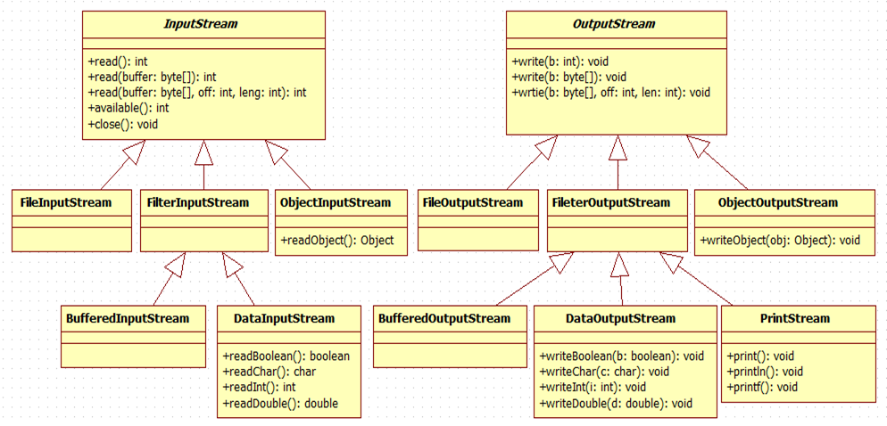
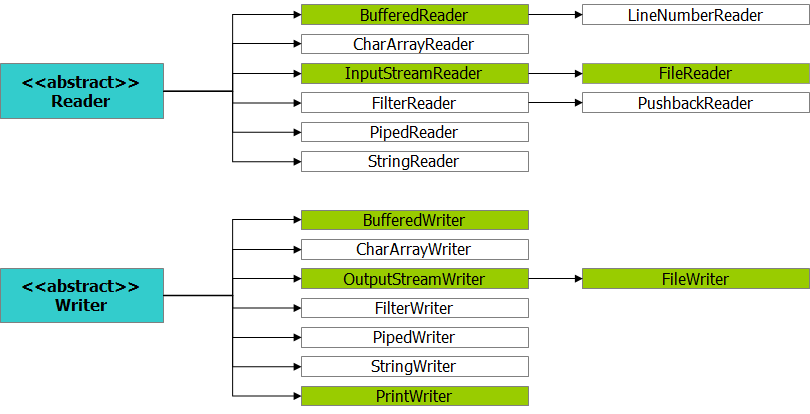

# Stream API를 이용한 데이터 입출력

* 입력(Input)

  > 프로그램에서 특정 목적지(키보드, 파일, 메모리, 네트워크 등)의 데이터를 읽어 들이는 것

* 출력(Output)

  > 프로그램에서 특정 대상(콘솔, 파일, 메모리, 네트워크 등)으로 데이터를  쓰는 것

* 표준 입출력

  > 키보드를 통해 입력하고 콘솔을 통해 출력하는 것을 표준 입출력이라 한다.

* Stream API의 특징

  * 입출력 대상에 상관 없이 일관된 방법으로 데이터를 읽고, 쓸 수 있다.
    * 스트림은 목적지로부터 일련의 데이터(연속된 바이트)를 읽고, 쓰기위한 중간자 역할이다.
  * 스트림은 단방향이다.
    * Stream API는 읽기 용도의 입력스트림클래스드로가 쓰기 용도의 출력 스트림 클래스들을 별도로 제공한다.
  * 스트림은 FIFO(First In First Out) 구조이다.
    * 먼저 출력한 데이터를 먼저 읽어 들인다.

* Stream 분류

  * 데이터 목적지의 종류에 따라 여러 종류의 스트림 클래스가 제공된다.
    * 입출력 프로그램을 작성할 경우 데이터 목적지에 맞는 스트림 클래스를 선택하고, 객체를 생성하여 메소드를 이용하여 데이터 입출력을 수행
  * 입출력 방향에 따른 분류
    * 입력스트림 (InputStream, FileInputStream 등)
    * 출력스트림 (InputStream, FileInputStream 등)
  * 입출력하고자 하는 데이터 종류에 따른 분류
    * 바이트(byte) 스트림 : 데이터를 바이트 단위 그대로 읽고 쓰기
    * 문자(character) 스트림 : 바이트 데이터를 문자로 가공(인코딩 및 디코딩)
  * 입출력 스트림 용도에 따른 분류
    * 노드(Node) 스트림 : 단순한 입출력만 담당
    * 필터(Filter) 스트림 : 스트림의 데이터를 조작

* Stream API 구조 (java.io.*)

  
  * InputStream, OutputStream 추상클래스이다.
  * InputStream
    * read()는 한 바이트씩 읽어 오는 것. 읽어올 것이 없으면 -1을 반환함.
    * available() 은 읽어 올 수 있는 사이즈를 가져오는 메소드.
    * close() 는 생성된 메모리를 다시 제거하는 메소드. 안하면 메모리에 쌓임!!


## 바이트 스트림

* 데이터를 1 바이트 단위로 읽고, 쓰기 위한 스트림 클래스
* 추상클래스 InputStream/OutputStream 이하 여러 개의 서브 클래스 존재


### InputStream 클래스

* InputStream 클래스는 입력스트림(바이트)의 최상위 추상 클래스
* 추상이기 때문에 new 키워드를 통해서 객체를 생성할 수 없으나 입력에 관련된 기본적인 메소드를 정의하고 있다.

| 메소드                                          | 기               능                                          |
| ----------------------------------------------- | ------------------------------------------------------------ |
| abstract int read()                             | 스트림으로부터   1바이트를   읽어 들이고,   만일   스트림의 끝일 경우      -1을   리턴한다.리턴값이   int   형이기   때문에,   읽어들인   바이트 데이터를 문자로 사용하고자 할 경우에는 char형으로   형변환하여야 한다. |
| int read(byte[] buffer)                         | 스트림으로 부터   바이트 배열 사이즈 만큼 읽어서 buffer에   채운다.   리턴값은   버퍼에 채운 바이트수를 리턴한다. |
| int read(byte[] buffer, int offset, int length) | 스트림으로 부터 length   만큼   읽어들여서 buffer의 offset   부터      채운다 |
| int available()                                 | read()   메소드   호출이 블록킹 되지   않으면서 읽을 수 있는 바이트수 |
| void close()                                    | 스트림을 닫고,   스트림과 관련된 운영체제 자원을 모두 반납.  |
| long skip(long n)                               | 지정한 바이트수 만큼 건너뛴다.실제로 건너 뛴 바이트 수 리턴  |
| void mark(int readlimit)                        | 스트림내의 현재 위치에 표시해 둔다.                          |
| void reset()                                    | 표시된 위치(marked)로   되돌린다.                            |

* 코드 예제
  ``` java
  import java.io.FileInputStream;
  import java.io.FileNotFoundException;
  import java.io.IOException;
  import java.io.InputStream;
  public class InputStreamExample {
    	static final String path = "C:\\KOSTA187\\설치프로그램\\staruml-5.0-with-cm.exe";
      public static void main(String[] args) {
          InputStream in=null;
          try {
              in = new FileInputStream(path);
              System.out.println(in.available());
      //			int b = in.read(); // 읽을 게 없을 땐 -1 반환
      //			System.out.println(b);
  
      //			int b = 0;
      //			while((b=in.read()) != -1) {
      //				System.out.println(b);
      //			 }
              // byte[](버퍼) 단위로 입력
              byte[] buffer = new byte[4*1024];
      //			int count = in.read(buffer); // 데이터는 buffer에 저장이 되고 count에는 읽어온 바이트 수를 반환한다.
      //			System.out.println(count);
      //			for (byte b : buffer) {
      //				System.out.println(b);
      //			}
              int count = 0;
              int totalCount = 0;
              while((count=in.read(buffer)) != -1) {
                  System.out.println(count);
                  totalCount += count;
              }
  
              System.out.println(in.available());
              System.out.println(totalCount+" 파일 다 읽었음");
  
          } catch (FileNotFoundException e) {
              e.printStackTrace();
          } catch (IOException e) {
              // TODO Auto-generated catch block
              e.printStackTrace();
          } finally {
              try {
                  if(in != null) in.close();
              } catch (IOException e) {
                  // TODO Auto-generated catch block
                  e.printStackTrace();
              }
          }
      }
  }
  ```

  * InputStream는 인터페이스이므로 구현하기 위해 해당 인터페이스를 실현한 FileInputStream 클래스를 이용하였다.
  * FileInputStrea 클래스는 시스템의 파일로부터 순차적인 방법으로 데이터를 한바이트식 읽어 올 수 있다.
  * 지정한 파일이 존재하지 않는 경우 IOException이 발생한다.


### OutputStream 클래스

* OutputStream 클래스는 출력스트림(바이트)의 최상위 추상 클래스
* 추상이기 때문에 new 키워드를 통해서 객체를 생성할 수 없으나 출력에 관련된   기본적인 메소드를 정의하고 있다.

| 메소드                                              | 기               능                                          |
| --------------------------------------------------- | ------------------------------------------------------------ |
| void   write(int   b)                               | 스트림에   한바이트를 쓴다.                                  |
| void   write(byte[] buffer)                         | 스트림에 배열   buffer   만큼   쓴다.                        |
| void   write(byte[] buffer, int offset, int length) | 스트림에 buffer의   내용을 offset부터 length만큼   쓴다.     |
| void   flush()                                      | 스트림에 의해   쓰여진 buffer에   있던 내용을 강제적으로 출력한다. |
| void   close()                                      | 스트림을 닫고,   스트림과   관련된 운영체제 자원을 모두 반납. |

* 출력시 만들어지는 파일에 들어 갔을 때 나오는 값이나 문자는 디코딩이 되어 나타난것.

  * 그 값은 브라우저나 어떤 것으로 열때마다 다르게 나올 수 있음

  * 스트림 출력은 단순히 출력만 하는 것.

  ``` java
  import java.io.FileOutputStream;
  import java.io.IOException;
  import java.io.OutputStream;
  
  public class OutputStreamExample {
  	
  	static final String path = "example.dat";
  	
  	public static void main(String[] args) throws IOException {
  		OutputStream out = new FileOutputStream(path,true);
  //		out.write(65);
  //		out.close();
  //		System.out.println("파일에 1바이트 썻음");
  		
  		byte[] buffer = new byte[128];
  		for (int i = 0; i < buffer.length; i++) {
  			buffer[i] = (byte) i;
  		}
  		out.write(buffer);
  //		out.write(buffer, 0, buffer.length); // 위와 동일한 결과를 가져오게 됨.
  		out.close();
  		System.out.println("파일에 128바이트 썻음");
  	}
  }
  ```

  * FileOutputStream 클래스를 이용해 OutputStream 인터페이스를 구현했다.
  * FileOutputStream은 FileInputStream과 비슷하게 바이트 데이터를 파일에 저장하기 위해 사용되는 스트림 클래스이다.
  * 지정한 파일이 이미 존재할 경우 그 파일에 덮어쓰게 된다.

* 파일 복사하는 코드 예제

  ``` java
  import java.io.FileInputStream;
  import java.io.FileOutputStream;
  import java.io.IOException;
  import java.io.InputStream;
  import java.io.OutputStream;
  
  public class CopyExample {
  
  	public static long copy(String srcPath, String destPath) throws IOException {
  		InputStream input = null;
  		OutputStream output = null;
  
  		try {
  			input = new FileInputStream(srcPath);
  			output = new FileOutputStream(destPath, true);
  			byte[] buffer = new byte[4 * 1024];
  			int count = 0;
  			long totalCount = 0;
  			
  			while ((count = input.read(buffer)) != -1) {
  				output.write(buffer, 0, count);
  				totalCount += count;
  			}
  			return totalCount;
  		} finally {
  			if (output != null) output.close();
  			if (input != null) input.close();
  		}
  	}
  
  	public static void main(String[] args) {
  
  		String src = "C:\\KOSTA187\\설치프로그램\\jdk-8u181-windows-x64.exe";
  		String dest = "eclipse.zip";
  
  		long copySize = 0;
  		try {
  			copySize = copy(src, dest);
  		} catch (IOException e) {
  			// TODO Auto-generated catch block
  			e.printStackTrace();
  		}
  		System.out.println(copySize + " 바이트 파일 복사 완료...");
  	}
  
  }
  ```


### 필터(Filter) 스트림

* 일반 노드 스트림은 바이트 단위로 데이터를 읽고, 쓰는 기능만 제공
* 기존 노드 스트림에 특정 기능을 가진 필터 스트림을 연결해서 원하는 동작을 지원
  * 효율성
  * 다양한 타입으로 읽고 쓰기
  * 다중연결
  * 되돌림
  * 라인넘버링 등
* 필터 스트림은 바로 만들수는 없고 노드가 필요함


#### BufferedInputStream 클래스

* 위의 필터 스트림을 확장한 서브 클래스

* 데이터들을 중간에 저장해 놓는 것.

  - 저수지에서 바로 논으로 물을 끌어올수도 있지만 저수지에서 중간에 물탱크에 저장해 놓았다가 논으로 물을 끌어올 수 있다.

  - 필터 스트림은 물탱크와 같은 기능을 하는 것

  - 임의의 접근을 가능하게 하기 위해서!!

  - 물탱크까지 물을 끌어올 수 있는 역할을 하는 노드가 필요함

    ``` java
    // Node Stream
    InputStream fin = null;
    fin = new FileInputStream(path);
    
    // Filter Stream
    BufferedInputStream in = null;
    in = new BufferedInputStream(fin);
    ```

* `mark(int n)`메소드를 통해  현재위치를 깃발을 꽂은것처럼 저장할 수 있다.
  - 마치 어디서 시작하겠다고 깃발을 꽂아 놓는 것과 같다.
  - `n`값으로 얼만큼의 저장 공간을 할당할지 정한다.
  - mark 후에 `read`를 하면 이 할당된 공간에 저장이 되고`reset()`메소드를 통해 이 할당된 공간의 처음으로 돌아갈 수 있다.
* `skip(long n)`메소드를 통해 n만큼의 바이트를 건너 뛸 수 있다.

* 코드 예제

  ``` java
  // BufferedInputStreamExample
  
  import java.io.BufferedInputStream;
  import java.io.FileInputStream;
  import java.io.IOException;
  import java.io.InputStream;
  
  public class BufferedInputStreamExample {
  
  	static final String path = "C:\\KOSTA187\\설치프로그램\\staruml-5.0-with-cm.exe";
  
  	public static void main(String[] args) throws IOException {
  		// Node Stream
  		InputStream fin = null;
  		fin = new FileInputStream(path);
  		
  		// Filter Stream
  		BufferedInputStream in = null;
  		in = new BufferedInputStream(fin); // 512바이트 배열
          
          // 처음 위치에 깃발을 꽃아 넣음.
  		in.mark(0);
  		System.out.println(in.read());
  		System.out.println(in.read());
  		System.out.println(in.read());
  		in.skip(10);
  		System.out.println(in.read());
  		System.out.println("=======");
          // 아까 지정한 위치로 돌아감.
  		in.reset();
          
          // 다시 깃발 꽃은 곳에서 한 칸 이동 하고
  		System.out.println(in.read());
          // 이동한 위치에서 깃발을 꽃아 놓는다.
  		in.mark(0);
  		System.out.println(in.read());
  		System.out.println(in.read());
  		System.out.println("=======");
          // 리셋 후에 출력하면 
  		in.reset();
  		System.out.println(in.read());
  	}
  
  }
  ```

  실행 결과

  ```
  77
  90
  80
  255
  =======
  77
  90
  80
  =======
  90
  ```


#### BufferedOutputStream

* 코드 예제

  ``` java
  // BufferdOutputStreamExample
  
  import java.io.BufferedOutputStream;
  import java.io.FileOutputStream;
  import java.io.IOException;
  
  public class BufferdOutputStreamExample {
  
  	static final String path = "example2.dat";
  	
  	public static void main(String[] args) throws IOException {
  
  		FileOutputStream fos = new FileOutputStream(path);
  		
  		// 기본 512 바이트가 가득 차면 자동으로 저장한다.
  		BufferedOutputStream out = new BufferedOutputStream(fos);
  		out.write(10);
  		out.write(10);
  		byte[] data = {5,6,7,8,9};
  		out.write(data);
  				
  		out.flush(); // 이걸 통해 중간 저장소가 가득 차지 않아도 데이터를 저장하라고 명령할 수 있다.
  		System.out.println("파일에 데이터 썻음..");
  		
  		if(out != null) out.close();
  		if(fos != null) fos.close();
  	}
  }
  ```


#### DataInputStream / DataOutputStream 클래스

* 이전까지는 바이트 단위의 입출력이었고 이를 출력해도 우리가 알아볼수 없었다.
* 하지만 우리는 자바에서 기본으로 제공하는 기본 데이터 타입을 그대로 입력하고 출력하는 일을 하고 싶을 수 있고 이를 하기 위해 만들어진 클래스들이다.
* 이 스트림 클래스 없이도 바이트 스트림을 통해 각 데이터의 크기에 따라 저장하고 읽어오면 잘 저장할 수 있지만 너무 귀찮고 헷갈리는 일
* 이 일들을 다 만들어 놓은 클래스
* 이때 내가 저장한 파일에 어떤 순서로 데이터를 저장했는지가 매우 중요함!!
  - 우리가 이 파일을 열어본다고 어떻게 이뤄져 있는지 알 수가 없음.
  - 우리가 저장한 순서에 따라 읽어야만 데이터를 잘 읽어 올 수 있음

* 코드 예제

  ``` java
  // DataOutputStreamExample
  
  import java.io.DataOutputStream;
  import java.io.FileOutputStream;
  import java.io.IOException;
  
  public class DataOutputStreamExample {
  
  	static final String path = "example3.dat";
  	
  	public static void main(String[] args) throws IOException {
  		boolean flag = false;
  		char c = '김';
  		int age = 30;
  		double weight = 77.7;
  		String message = "입출력 프로그램입니다.";
  		
  		DataOutputStream out = new DataOutputStream(new FileOutputStream(path));
  //		DataOutputStream out = new DataOutputStream(new BufferedOutputStream(new FileOutputStream(path)));
  		
  		out.writeBoolean(flag);
  		out.writeChar(c);
  		out.writeInt(age);
  		out.writeDouble(weight);
  		out.writeUTF(message);
  		
  		out.close();
  		System.out.println("썻음");
  	}
  }
  ```

  ``` java
  // DataInputStreamExample
  
  import java.io.DataInputStream;
  import java.io.FileInputStream;
  import java.io.IOException;
  
  public class DataInputStreamExample {
  
  	static final String path = "example3.dat";
  
  	public static void main(String[] args) throws IOException {
  		boolean flag = false;
  		char c = 0;
  		int age = 0;
  		double weight = 0;
  		String message = null;
  
  		DataInputStream in = new DataInputStream(new FileInputStream(path));
  //		DataOutputStream out = new DataOutputStream(new BufferedOutputStream(new FileOutputStream(path)));
  
  		flag = in.readBoolean();
  		c = in.readChar();
  		age = in.readInt();
  		weight = in.readDouble();
  		message = in.readUTF();
  
  		in.close();
  		System.out.println("읽었음");
  		System.out.println(flag);
  		System.out.println(c);
  		System.out.println(age);
  		System.out.println(weight);
  		System.out.println(message);
  	}
  }
  ```

  파일에 입력된 값

  ```
  �@   @Sl�����입출력 프로그램입니다.
  ```


#### PrintStream

* 자바의 모든 데이터를 String으로 바꿔서 출력하는 클래스

* 이건 내가 파일에 똑같이 데이터를 저장해 보고 싶을 때 사용하는 클래스

* 우리가 사용하던 `System.out.println()`또한 PrintStream을 이용해 만든 메소드이다.

* 코드 예제

  ``` java
  // PrintStreamExample
  
  import java.io.IOException;
  import java.io.PrintStream;
  import java.util.Calendar;
  
  public class PrintStreamExample {
  
  	static final String path = "example4.dat";
  
  	public static void main(String[] args) throws IOException {
  		boolean flag = false;
  		char c = '김';
  		int age = 30;
  		double weight = 77.7;
  		String message = "입출력 프로그램입니다.";
  		
  		Calendar now = Calendar.getInstance();
  
  //		PrintStream out = new PrintStream(new FileOutputStream(path));
  		PrintStream out = new PrintStream(path);
  
  		out.println(flag);
  		out.println(c);
  		out.println(age);
  		out.println(weight);
  		out.println(message);
  		out.printf("%1$tF %1$tT", now);
  
  		out.close();
  
  		System.out.println("썻음");
  	}
  }
  ```

  실행 결과

  ```
  false
  김
  30
  77.7
  입출력 프로그램입니다.
  2018-09-04 09:53:26
  ```


## (cf) File 클래스

* 파일 및 디렉토리에 대한 기본 정보(크기, 변경날짜 등)를 제공하거나, 관리할 수 있는 기능을 제공한다.

* 스트림 클래스가 아니기 때문에 파일 내용에 대한 접근 기능은 제공하지 않는다.

* 파일의 복사, 이름 변경 등의 조작을 할 경우에만 사용되며, 파일 데이터를 입출력 하기 위해서는 File 입출력 스트림이나 RandomAccessFile 로 해줘야 한다.

* 파일이 존재하는지 존재하지 않는지도 검사 가능하다.

* | 생성자                               | 설               명                                          |
  | ------------------------------------ | ------------------------------------------------------------ |
  | File   (String pathName)             | 주어진   경로명을 가지고 새로운 File 객체를   생성한다.      |
  | File   (String parent, String child) | 주어진   두개의   경로명을 가지고 새로운 File 객체를   생성한다.   parent는 디렉토리이며,   child는 디렉토리 또는   파일일 수 있다. |
  | File   (File parent, String child)   | 주어진   File   객체와   문자열을 이용하여 새로운 File 객체를   생성한다.   parent   객체는   디렉토리이며,   child는   디렉토리 또는 파일일 수 있다. |

* | 메소드                     | 설               명                                          |
  | -------------------------- | ------------------------------------------------------------ |
  | String   getName()         | 경로명이   나타내는 파일 또는 디렉토리의   이름을 얻는다.   이   이름은 경로명에 있는 마지막 이름입니다. |
  | String   getParent()       | 경로명의   부모 경로에 대한 경로명을 얻는다. 부모   경로명은 경로명에 있는 마지막 이름을 제외한 나머지 이름들을 포함하고 있다. |
  | File   getParentFile()     | 경로명의   부모 경로에 대한 File   객체를   얻는다.   부모   경로명은 경로명에 있는 마지막 이름을 제외한 나머지 이름들을 포함하고 있다. |
  | String   getPath()         | 경로명을   얻는다.                                           |
  | boolean   isAbsolute()     | 절대   경로명인지를 얻는다.   유닉스시스템상에서는   prefix가 “/”를   포함하고 있을 경우,   Win32 시스템상에서는   prefix가 “\\”와   드라이브문자 또는 “\\”를   포함하고 있을 경우 절대경로이다. |
  | String   getAbsolutePath() | 절대   경로명을 얻는다.                                      |
  | URL   toURL()              | 경로명을   URL로   변환하여 얻는다.                          |

* 코드 예제

  ``` java
  // FileExample
  
  import java.io.File;
  import java.io.FileOutputStream;
  import java.io.IOException;
  import java.util.Calendar;
  
  public class FileExample {
  
  	public static void main(String[] args) throws IOException {
  		String path = "c:/some.dat";
  		File file = new File(path);
  
  		System.out.println("존재여부 : " + file.exists());
  
  		path = "C:\\KOSTA187\\설치프로그램\\staruml-5.0-with-cm.exe";
  		file = new File(path);
  
  		System.out.println("파일용량: " + file.length());
  
  		Calendar cal = Calendar.getInstance();
  		cal.setTimeInMillis(file.lastModified());
  		System.out.println(String.format("변경날짜: %1$tF %1$tp %1$tI:%1$tM:%1$tS", cal));
  
  		path = "c:/KOSTA187";
  		file = new File(path);
  		/*
  		 * if(file.isDirectory()) { System.out.println("디렉토리");
  		 * System.out.println(path); for (String string : file.list()) {
  		 * System.out.println("\t"+string); } }else if(file.isFile()) {
  		 * System.out.println("파일"); }
  		 */
  
  		File[] lists = file.listFiles();
  		System.out.println(path);
  		for (File file2 : lists) {
  			if (file2.isDirectory()) {
  				System.out.println("<DIR>\t" + file2.getName());
  			} else {
  				System.out.println(file2.getName() + "\t" + file2.length());
  			}
  		}
  
  		path = "example.dat";
  		file = new File(path);
  		System.out.println("절대경로 : " + file.getAbsolutePath());
  
  //		System.out.println(file.toURL()); // 이제 이건 사용하지 않고 toURI()를 사용한다.
  		System.out.println(file.toURI());
  
  		// 조작관련 기능들..
  		path = "xxx.dat";
  		file = new File(path);
  		System.out.println(file.createNewFile()); // 이건 임시 파일이 아니라 실제 파일이 만들어지는 것
  
  		// 임시 파일을 만들고 데이터 저장하기
  		File tempF = File.createTempFile("some", ".dat");
  		System.out.println(tempF.getAbsolutePath());
  		FileOutputStream out = new FileOutputStream(tempF);
  		out.write(10);
  		out.close();
  		tempF.deleteOnExit(); // 종료시 임시 파일 삭제
  
  		// 지정 경로에 폴더 만들기
  		File dir = new File("C:/KOSTA187/xxx");
  		System.out.println(dir.mkdirs());
  		dir.delete();
  
  		File[] drives = File.listRoots();
  		for (File file2 : drives) {
  			System.out.println(file2);
  		}
  	}
  }
  ```

  실행 결과

  ```
  존재여부 : false
  파일용량: 22725959
  변경날짜: 2018-08-20 오후 04:15:19
  c:/KOSTA187
  ams_정지원.jar	29753
  run.bat	31
  study.lnk	1333
  <DIR>	tools
  <DIR>	workspace
  <DIR>	설치프로그램
  절대경로 : C:\KOSTA187\workspace\IOStudy\example.dat
  file:/C:/KOSTA187/workspace/IOStudy/example.dat
  false
  C:\Users\KOSTA\AppData\Local\Temp\some9040521103498509818.dat
  true
  C:\
  D:\
  ```


## 문자 스트림



* 문자(character) 스트림 : 2 바이트 단위로 데이터 입출력
* 바이트 스트림을 확장한 서브 클래스
* Input,OutputStream이 아니라 Reader, Writer 추상 클래스가 존재
* FileInputStream 대신에 FileReader 클래스가 존재하고 FileOutputStream 대신에 FileWriter 클래스가 존재한다.
* 우리가 실제 사용할 때는 FileReader, FileWriter를 사용하지 않고 BufferedReader, BufferedWriter를 주로 사용한다.


### Reader

* 기본 메소드
  * int read();
  * int read(char[] buffer);
  * int read(char[] buffer, int offset, int length);


#### FileReader

* 디코딩이 필요함.
* 사용해도 상관은 없지만 잘 사용하지 않고 대신 BufferedReader 클래스를 많이 사용함

* 코드 예제

  ``` java
  // FileReaderExample
  
  import java.io.FileInputStream;
  import java.io.FileReader;
  import java.io.IOException;
  
  public class FileReaderExample {
  
  	public static void main(String[] args) throws IOException {
  		String path = "src/day13/BufferedInputStreamExample.java";
  		FileReader in = new FileReader(path);
  		System.out.println((char)in.read());
  		char[] buffer = new char[1024];
  		int count = 0;
  		while ((count = in.read(buffer)) != -1) {
  			for (char c : buffer) {
  				System.out.print(c);
  			}
  		}
      }
  }
  ```

  * 실행하면 해당 path의 파일을 char 단위로 읽어오게 된다.
  * 위 예제에선 한 자바 파일의 내용을 출력해주고 있다.
  * `String`은 `getChars()` 메소드가 있어서 가지고 있는 내용을 char[] 로 반환해주는 데 이를 이용해 java 파일의 내용을 복사해오게 된다.


#### BufferedReader

* FileReader 클래스와 다르게 디코딩이 필요 없음
  * 하드에 저장되어있던 숫자를 문자로 디코딩 해줌
  * 운영체제가 가지고 있는 형싱으로 디코딩한다.

* `readLine()`메소드가 있어 자동으로 한 줄을 읽어와 `String`으로 반환해줌

  * 이때 마지막 `\n`도 자동으로 없애고 받아옴

* 이런 간편성때문에 많이 사용함

* 코드 예제

  ``` java
  import java.io.BufferedReader;
  import java.io.FileReader;
  import java.io.IOException;
  
  public class BufferedReaderExample {
  
  	public static void main(String[] args) throws IOException {
  		String path = "src/day13/BufferedInputStreamExample.java";
  		FileReader in = new FileReader(path);
  
  		BufferedReader br = new BufferedReader(in);
  
  		String txt = null;
  		int number = 0;
  		while ((txt = br.readLine()) != null) {
  			System.out.println(++number+":"+txt);
  		}
  		br.close();
  	}
  }
  ```


#### InputStreamReader

* BridgeStream
  * 컴퓨터에 쓰여 있는 바이트를 가져와 영어라고 생각되면 1바이트 되어 있던 바이트를 2바이트로 만들고 한글은 그래도 2바이트로 받아오는 것
  * Reader가 무조건 2바이트로 받아오기 때문에 그런 문제를 해결하기 위해서 사용된다고 생각해도 된다.

* `InputStreamReader`를 이용해 File이 아닌 다른 데이터를 2바이트 형식으로 읽어올 수 있다.

* 코드 예제

  ``` java
  import java.io.BufferedReader;
  import java.io.IOException;
  import java.io.InputStreamReader;
  
  public class BridgeStreamExample {
  
  	public static void main(String[] args) throws IOException {
  		
  		System.out.print("당신의 이름 : ");
  		
  		InputStreamReader isr = new InputStreamReader(System.in);
  		BufferedReader br = new BufferedReader(isr);
  		String name = br.readLine();
  		System.out.println(name);	
  	}
  }
  ```

  * 위의 예제에서는 파일의 내용을 가져오는 것이 아니라 `System.in`이라는 InputStream 클래스를 이용해 위에서 배운`BufferedReader` 클래스를 이용하는 방법이다.
  * 이처럼 `BufferedReader` 를 사용할때 브릿지를 이용하면 다양한 데이터를 다양한 소스로부터 받아올 수 있다.

  실행 결과

  ```
  당신의 이름 : 정지원
  정지원
  ```

  * 위의 실행 결과에서 당신의 이름에 적힌 "정지원'"이 사용자가 입력한 값이고 아래가 출력 결과이다.

* 코드 예제 2

  ``` java
  import java.io.BufferedReader;
  import java.io.IOException;
  import java.io.InputStream;
  import java.io.InputStreamReader;
  import java.net.MalformedURLException;
  import java.net.URL;
  
  public class URLExample {
  
  	public static void main(String[] args) {
  
  		String urlString = "https://news.v.daum.net/v/20180907095347180?rcmd=rn";
  
  		try {
  			URL url = new URL(urlString);
  			System.out.println(url.getProtocol());
  			System.out.println(url.getHost());
  
  			InputStream in = url.openStream();
  
  			BufferedReader reader = new BufferedReader(new InputStreamReader(in));
  			String text = null;
  			while((text = reader.readLine()) != null)
              {
  				System.out.println(text);
  			}
          } catch (MalformedURLException e) {
          } catch (IOException e) {
  		}
  	}
  }
  ```

  * 위의 예제는 아직 배우지는 않았지만 `URL` 클래스를 이용해 특정 홈페이지의 코드 내용을 `BufferedReader`와 `InputStreamReader`를 이용해 만든 코드이다.
  * 실행 시 홈페이지를 구성하는 코드를 볼 수 있다.


### Writer

* 기본 메소드
  * void write(int c);
  * void write(char[] buffer);
  * void write(char[] buffer, int offset, int length);


#### FileWriter

* 코드 예제

  ``` java
  import java.io.BufferedWriter;
  import java.io.FileWriter;
  import java.io.IOException;
  
  public class FileWriterExample {
  
  	public static void main(String[] args) throws IOException {
  		String path = "example5.txt";
  		
  		String message = "아 배고파...";
  		
  		FileWriter out = new FileWriter(path);
  		
  //		char[] chars = new char[100];
  //		message.getChars(0, message.length(), chars, 0);
  //		out.write(chars);
  		
  		BufferedWriter bw= new BufferedWriter(out);
  		bw.write(message);
  		bw.close();
  		out.close();
  	}
  }
  ```


#### PrintWriter

* `BufferedReader`와는 다르게 `BufferedWriter` 클래스는 잘 사용하지 않는다.
* 대신에 이 `PrintWriter`를 자주 사용한다.
* 우리가 사용했던 `PrintStream`의 기능이 비슷하게 구현되어 있다.
* 우리가 원하는 데이터를 Buffer로 받아와 저장한 뒤 다 차면 보내주는 게 기본 로직이다.
* 하지만 우리는 다 차지 않아도 보내고 싶을 수 있고 이럴 때 `flush()`메소드를 이용하면 보낼 수 있다.
* 하지만 이렇게 하려면 데이터를 보내고 싶을 때마다 `flush()`를 하고 싶은데 이게 귀찮다면 `PrintWriter`클래스를 만들 때 생성자에서 관련 기능을 활성화 시키면 된다.(autoflush)


#### StringReader

* `String`에 저장되어 있는 메시지를 메모리 관점으로 하나씩 접근하는 방식의 reader 방식


## 가변형 레코드

* 데이터를 `DataOutputStream`을 이용해 바이트로 저장한다고 해보자.
* 여러 계좌 정보를 저장한다고 해보자
* 그럼 계좌 비밀번호와 계좌 금액은 저장할 때 크기가 정해져 있으므로 문제가 없다.
* 그런데 계좌 이름과 계좌 번호를 문자로 받아와서 저장하려면 크기를 어떻게 정해야 할지 고민이 된다.
* 그냥 차례차례 읽는다고 생각하면 문제가 없지만 만약 저장한 것중에 3번째 계좌의 정보에 접근하고 싶을 때 문제가 생긴다.
* 만약 데이터의 크기를 모른다면 3번째 계좌에 접근하기 위해 앞에서부터 차례차례 접근해야 한다.
* `String`을 저장할 때 문제.
  * `writeUTF`로 문자를 입력하면 우리가 글자의 크기를 제한할 수가 없다.
  * 대신에 `writeChar`를 사용해서 한글자한글자 입력해야 한다.


## RandomAccessFile 클래스

* 이건 스트림 클래스라고 하지 않는다.
* 양방향 입출력이 가능하다!!
* 자바 8개의 데이터타입 별 읽기 및 쓰기가 가능하다
* `File`, `BufferedInput/OutputStream`, `DataInput/OutputStream` 통합 기능 제공한다.
* 다만, 파일 입출력에 대해서만 사용 가능하다.
* `length()` : 파일의 크기를 읽어오는 메소드
* `getFilePointer()` : 파일에 포인터 위치를 얻어오는 메소드
  * 우리가 입 출력을 한번에 실행해 포인터의 위치가 어딘지가 중요하다.
  * 만약 입력을 해놓고 포인터 위치를 되돌리지 않고 출력을 하려 하면 아무런 값도 얻어올 수 없다.
* `seek(int n)` : 파일의 포인터 위치를 절대값으로 정해주는 메소드
  * 우리가 특정 위치에 포인터 위치를 정해주려 하는 메소드