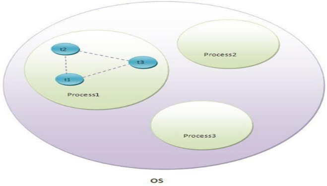
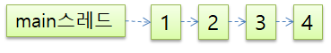
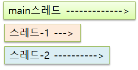
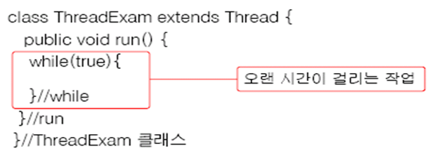
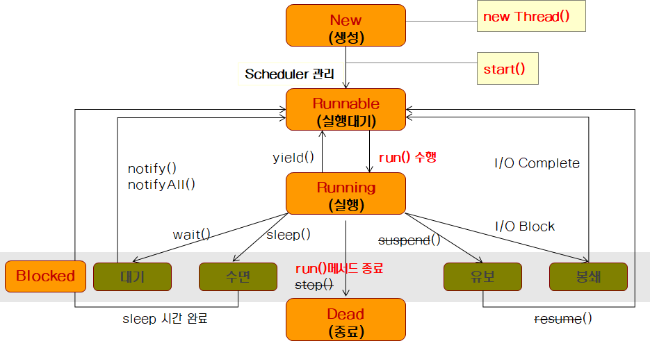
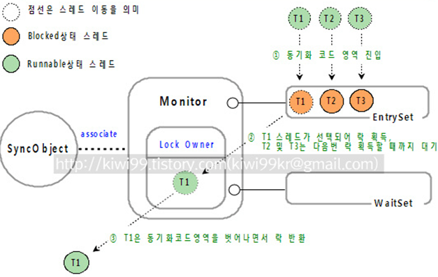
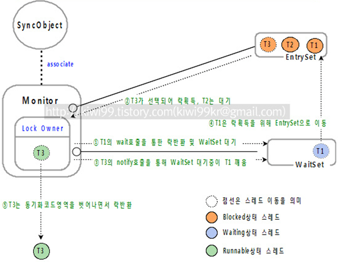

# 멀티 스레드 프로그래밍




## 스레드와 멀티 스레드

### 스레드

#### 스레드 정의

> 운영체제(OS)에 의해 실행중인 하나의 프로세스 내에서 독립적으로 실행되는 일련의 작업 단위(연속적인 실행코드)를 의미한다.

* 프로세스는 단지 스레드를 감싸는 포장이며, 실제 작업은 스레드가 담당한다.
* 자바 프로그램의 경우 프로그램 실행 시 JVM에 의해 메인 스레드가 자동 생성되며, 생성된 메인 스레드는 mian() 메소드를 찾아 실행한다.(기본적인 단일 스레드 환경 제공)


### 멀티 스레드

#### 멀티 스레드 정의

> 운영체제에 의해 여러 개의 프로세스들이 동시에 실행되는 멀티 태스킹(Multi-Tasking)과 달리 멀티 스레드는 하나의 프로세스 내에서 여러개의 작업이 동시에 실행되는 것을 의미한다.

* 멀티 태스킹의 경우 각 프로세스들이 독립된 메모리에 존재하며, 운영체제는 각각의 프로세스를 제어한다.
* 멀티 스레드의 경우 멀티 프로세스와 달리 **메모리를 공유**하면서 여러 개의 코드가 실행 될 수 있기 때문에 **리소스 절약과 효율적인 병렬 처리** 프로그래밍이 가능하다.
* 일반적인 프로그래밍 언어(C, C++ 등)의 경우 OS가 제공하는 스레드를 기본 기능으로 제공하지 않지만, 자바의 경우 멀티 스레드 지원을 위해 스레드 API를 기본 제공한다.
  * Thread 클래스와 Runnable 인터페이스를 제공하며, 동기화 처리를 위해 synchronized 키워드를 제공한다.


#### 멀티 스레드 특징

* 멀티 스레드로 실행되더라도 CPU는 원칙적으로 같은 시간에 단 하나의 동작주기를 수행한다.

  * 논리적인 측면에서 보면 여러 가지 작업이 동시에 수행되는 것처럼 보이지만, 실제 물리적인 측면에서는 매우 짧은 순간마다 하나의 실행이 수행되며, 실행 주기가 끝나면 다른 다른 실행이 반복되는 형태이다.
  * 멀티 스레드 환경에서는 단순히 독립적인 실행 코드를 작성하고, 필요할 때마다 스레드를 늘려 나가면 된다.

* 콩쿼러시? 동시성?

* 라운드로딩? 시분할? 으로 스케쥴링 되고 있음

* 단일 스레드 vs 멀티스레드

  * 단일 스레드

  
  * 멀티 스레드

    

* JVM(프로세스)은 기본적으로 멀티스레드로 동작한다.
  * 자바 애플리케이션은 JVM의 멀티 스레드 중 메인 스레드에 의해 실행된다.
  * main() 메소드는 메인 스레드에 의해 최초 실행되는 엔트리 포인트이다
  * 기타 JVM에 의해 자동으로 실행되는 스레드로는 클래스로더, 바이트코더 검증기, 우선순위가 가장 낮은 가비지 콜렉터 등이 있다.


## 자바 프로그램에서 스레드 생성과 실행

* JVM에 의해 자동 생성되는 main 스레드와 별개로 동작하는 사용자 스레드 작성을 위해 Thread 클래스와 Runnable 인터페이스를 제공한다.


### 방법 1. Thread 클래스를 상속 받아 스레드 정의



* 주요 메소드
  * `run()` 
    * main 스레드의 main() 메소드와 같이 사용자 정의 스레드의 엔트리 포인트 역할 메소드
  * `start()` 
    * 스레드를 실행시키기 위한 메소드
* 이 방법은 `Thread`를 상속받아 사용하기 때문에 다중 상속이 안되는 단점이 있다.


### 방법 2. Runnable 인터페이스 구현하여 스레드 정의

``` java
import java.awt.Frame;
import java.awt.Graphics;
import java.awt.Image;
import java.awt.Toolkit;
import java.awt.event.WindowAdapter;
import java.awt.event.WindowEvent;
import java.util.Random;

public class GameFrame extends Frame implements Runnable {
	Image image;
	public int x = 10;

	public GameFrame(String title) {
		super(title);
		image = Toolkit.getDefaultToolkit().getImage("abc.png");
	}

	public void setContests() {

	}

	public void eventRegist() {
		addWindowListener(new WindowAdapter() {
			@Override
			public void windowOpened(WindowEvent e) 			{
				gameStart();
			}
		});
	}

	public void gameStart() {
		Thread thread = new Thread(this);
		thread.start();
	}

	@Override
	public void run() {
		System.out.println("시작");
		Random random = new Random();

		for (int i = x; i <= 200; i += 10) {
			x = i;
			try {
				Thread.sleep(random.nextInt(500));
			} catch (InterruptedException e) {
			}
			repaint();
		}
	}

	@Override
	public void paint(Graphics g) {
//		g.fillOval(x, 50, 100, 100);
		g.drawImage(image, x, 50, this);
	}

}
```

``` java
public class RaceGame {

	public static void main(String[] args) {
		System.out.println("메인 스레드 시작");
		GameFrame frame = new GameFrame("경주게임");
		
		frame.setSize(500, 400);
		frame.eventRegist();
		frame.setVisible(true);
		
		System.out.println("메인 스레드 끝");
	}

}
```

* `run()` 추상메소드를 Runnable 인터페이스에 구현해놓았다.
* 이를 통해 다른 클래스를 상속받아야 하는 클래스에서 스레드를 구현할 수 있다.
* `start()`메소드가 없기 때문에 `Thread(Runnable)` 생성자를 이용하여 스레드를 생성한 후 `thread.start()`를 호출한다.


## 스레드 생명 주기(Life Cycle)



* 스레드는 5개의 상태(New, Runnable, Running, Block, Dead)를 가지며, 상태가 전이된다.

* 스레드는 start() 메소드 호출을 통해 활성화되고 실행되지만, 또 다른 스레드에 의해 선점되거나 대기 상태로 전이될 수 있다.

* 실행과 대기가 반복되다가 최종적으로 종료된다.

* 순서

  * 먼저 생성을 통해 새로운 스레드가 만들어진다.
  * 그 다음 `start()`를 만나면 큐에 FIFO처럼 저장이 된다.(스케쥴러)
  * 이때 실행대기 상태이며 가장 먼저 들어온 스레드가 실행되고 특별한 일이 없다면 다시 실행대기로 돌아간다.
  * 이렇게 라운드로딩? 이 되어가다 만약 `sleep()`을 만나면 스레드가 다시 실행대기로 가는 것이 아니라 블럭 상태로 넘어가게 된다.
  * 정해진 시간이 다 되면 다시 실행대기 상태로 큐에 들어간다.
  * 그러다 `run()` 메소드가 종료되면 스레드가 종료된다.

* `yield()`메소드는 실행 상태에서 실행대기 상태로 보내준다.

  * 이 메소드를 통해 스레드 사용을 어느정도 공평하게 사용할 수 있게 해준다.
  * 이 메소드가 실행될때 다시 실행대기 상태로 돌아갈때 자신의 우선순위를 고려해 자신보다 낮은 우선순위 앞으로 높은 우선순위 뒤로 순서가 정해진다.

* `join()`메소드는 

  * 이 메소드를 호출한 스레드는 기존 스레드가 종료될 때까지 기다린다.
  * 메인 메소드에서 다른 스레드를 사용한다면 메인 메소드에 사용된 스레드가 먼저 끝날 수 있다. 이때 `join()`메소드를 사용하면 메인 안에 사용되었던 스레드가 다 끝나기를 기다리게 할 수 있다.
  * 전달인자로 대기시간을 지정하면, 대기 시간 안에 기존의 스레드가 종료되지 않을 경우 예외가 발생하도록 되어 있다.

* 코드 예제

  ``` java
  public class CarExample {
  
  	public static void main(String[] args) throws InterruptedException {
  		System.out.println("메인 스레드에 의해 프로그램 시작됨...");
  		
  		Car car = new Car("방그리");
  		Car car2 = new Car("김홍기");
  		Car car3 = new Car("홍길동");
  		car.start();
  		car2.start();
  		car3.start();
  		
  		car.join();
  		car2.join();
  		car3.join();
  		
  		System.out.println("메인 스레드에 의해 프로그램 종료됨...");
  	}
  }
  ```

  실행 결과

  ````
  메인 스레드에 의해 프로그램 시작됨...
  방그리 자동차 Start
  방그리 자동차 0m 전진
  홍길동 자동차 Start
  김홍기 자동차 Start
  김홍기 자동차 0m 전진
  ...
  김홍기 자동차 Finish
  홍길동 자동차 10m 전진
  방그리 자동차 10m 전진
  방그리 자동차 Finish
  홍길동 자동차 Finish
  메인 스레드에 의해 프로그램 종료됨...
  ````

* 스레드 우선 순위를 이용한 스레드 제어

  * `Thread.MAX_PRIORITY  = 10`
  * `Thread.MIN_PRIORITY   =  1`
  * `Thread.NORM_PRIORITY  = 5`
    * 특별히 정하지 않으면 5로 지정된다.
  * `setPriority (int newPriority) `
    * 스레드의 우선순위  값 설정
    * 매개변수로 정수보다는 Thread의 정해진 상수를 이용할 수 있다면 이용하는 게 좋다.
  * `getPrioriry()`
    * 스레드의 현재 우선순위 값


## 독립 스레드와 데몬 스레드

### 독립 스레드

* main 스레드의 종료와 관계없이 독립적으로 실행되는 스레드


### 데몬 스레드

* main 스레드가 종료되는 시점에서 같이 종료되는 스레드
* `thread.setDemon(true);`
* 자동저장과 같은 기능을 만들때 사용하면 좋다.


## 스레드 동기화 / 모니터 모델

### 스레드 동기화 필요성

* 싱글스레드의 경우 자원을 가지고 작업하는 데 별문제가 없지만, 멀티스레드의 경우 여러 스레드가 같은 프로세스 내의 자원을 공유해서 작업을 하기 때문에 서로의 작업에 영향을 주게 된다. 
* 만일 스레드A가 작업하던 도중에 다른 스레드B에게 제어권이 넘어갔다고 하자
* 이때 스레드A가 작업하던 공유 데이터를 스레드B가 임의로 변경하였다면, 다시 스레드A가 제어권을 받아서 나머지 작업을 마쳤을 때 원래 의도했던 것과는 다른 결과를 얻을 수 있다.
* 즉, 데이터의 안정성과 신뢰성을 보장할 수 없다.
* 한 계좌에 돈을 넣을 때 스레드A가 1000원을 추가하려고 현재 잔액을 확인했다고 하자. 이때 스레드B가 이 잔액에 1000원을 추가하려고 스레드A가 하던 작업 중에 1000원을 계좌에 추가했다고 하자. 이때 스레드B가 잔액에 1000원을 추가한 뒤 스레드A가 1000원을 잔액에 추가했다면 실제로 추가된 금액은 1000원 밖에 되지 않는다.


### 모니터

자바 스레드 동기화 모델은 "모니터(Monitor)"라는 개념을 적용하고 있다.


#### 모니터 개념

* 하나의 공유 데이터(객체)마다 하나의 모니터를 결합할 수 있으며, 모니터는 동시에 2개 이상의 스레드에 의해 접근할 수 없도록 막는 잠금(lock) 기능을 제공함으로써 동기화를 지원한다.
* 즉, 데이터(객체)에 모니터를 결합하면 하나의 스레드가 그 데이터를 사용하는 동안에는 다른 스레드들이 그 데이터를 사용할 수 없게 된다.
* 자바에서는 synchronized 키워드가 선언된 메소드와 synchronized 블록에 의해 동기화되는 모든 객체에 고유한 모니터가 결합되어 동기화 작업을 수행하게 된다.
* 공중화장실 같은 상황이라고 생각할 수 있다.
  - 화장실 안에 있는 사람이 락을 걸어놓으면 다른 사람은 들어갈 수 없다.
  - 안에 있던 사람이 락을 풀고 나와야 다른 사람이 들어갈 수 있다.


#### 모니터락 획득 및 반환 과정


* 한 스레드가 동기화 코드 영역(synchronized 메소드 or block)에 접근하기 위해 EntrySet에 진입한다.
  * Runnable 상태 -> Blocked 상태
* 모니터락을 소유한 스레드가 있다면 해당 스레드가 모니터락을 반환할때까지 EntrySet에서 대기한다.
  * Blocked 상태
* 모니터락을 소유한 스레드가 없다면 EntrySet에서 대기하던 스레드 중 하나가 선택되어 모니터락을 획득하고 실행을 하게 된다.
* 실행 후엔 동기화 코드 영역을 벗어나면서 소유한 모니터락을 반환한다.
* 선택된 스레드는 Runnalbe 상태이고 나머지 스레드는 Blocked 상태이다.


#### 조건에 따른 스레드 처리 과정



* 모니터락이 걸릴때 Object에 락이 걸리는 것이다.
* `wait()`라는 메소드는 Object 클래스에 포함되어 있는 메소드이다.
* `wait()`를 통해 WaitingPool로 넘어간 스레드를 깨워주는 메소드 `notify()` 또한 Object 클래스에 포함되어 있는 메소드이다.
* `wait()`, `notify()`는 synchronized 안에서만 사용 가능한 메소드이다.


### Synchronized 키워드 / 블록

* Synchronized 키워드가 선언된 메소드

  ``` java
  public synchronized void someMethod(){
      // 동기화 코드 영역
  }
  ```

* Synchronized 블록

  ``` java
  public void someMethod(){
      synchronized(동기화할 객체 또는 동기화할 클래스){
          // 동기화 코드 영역
      }
  }
  ```

