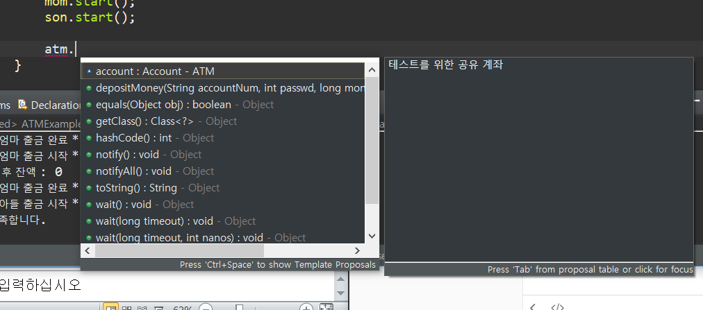

# 리플렉션(Reflection) API

* Reflection(반사, 반영)

  * 프로그램 실행 시 메모리상에 생성된 객체(인스턴스)와 관련된 클래스 정보를 분석하는 기술

  * 자바 언어는 Reflection API 제공(java.lang.reflect 패키지)

  * 우리가 이클립스에서 어떤 인스턴스 변수에 들어 있는 메소드를 사용할 때 ctrl + space 를 누르면 관련된 메소드들을 볼 수 있다.

  * 이때 뜨는 창에 나오는 정보들이 Reflection을 통해 만들어 진것이다.

  * 자바 언어는 Reflection API 제공(java.lang.reflect 패키지)

  * Reflection API의 일반적 활용

    * 메모리에 할당되어 있는 객체(인스턴스)의 유형(클래스) 파악
    * 객체의 멤버(속성/메소드) 분석
    * 분석된 정보를 이용하여 속성 및 메소드 동적 호출 가능

  * 코드 예제

    ``` java
    Top t1 = new Top(); // t1의 유형을 모른다고 가정
    Class c = t1.getClass();// Object의 기본 메소드 사용
    System.out.println(“t1의 유형(클래스이름)은 : + c.getName());
    
    ```


## Class 클래스

### Class 클래스

* Reflection API의 대표적인 클래스로 메모리에 생성된 객체의 타입(class)에 관한 정보를 제공
* ClassLoader에 의해 "*.class" 파일이 Static 영역에 로딩된 후 JVM이 "*.class" 파일에 대한 Class 객체를 자동 생성


### Class 를 얻어오는 3가지 방법

1. `인스턴스변수.getClass()` 기본 메소드 사용

``` java
Class c = new To().getClass();
```

2. `Class.forName()` 메소드 이용

``` java
Class c = Class.forName("패키지명포함 클래스 풀네임");
```

3. `.class`로 접근

``` java
Class c = Top.class;
```


### Class 클래스 사용

``` java
import java.lang.reflect.Field;
import java.lang.reflect.Method;
import java.lang.reflect.Modifier;

public class ReflectionExample {

	public static void main(String[] args) {
		String str ="리플렉션이 뭔가요?..";
		
		Class cls = str.getClass();
		System.out.println(cls.getModifiers());
		System.out.println(Modifier.PUBLIC);
		System.out.println(cls.getName());
		System.out.println(cls.getSimpleName());
		System.out.println(cls.getSuperclass().getName());
		Field[] fs = cls.getFields();
		for (Field field : fs) {
			System.out.println(field.getName());
		}
		Method[] ms = cls.getMethods();
		for (Method method : ms) {
			System.out.println(method);
		}
		
	}

}
```


### 동적 객체 생성

#### 매개변수 없는 동적 객체 생성

디폴트 생성자를 이용해 객체를 생성하는 과정이다.

``` java
String className = "java.util.Vector";
		
Object object = null;		
try {
    Class cls = Class.forName(className);
    // 디폴트생성자 호출
    object = cls.newInstance();
    System.out.println(object instanceof Vector);

    // 필요에 따라 Down Casting
    Vector vector = (Vector)object;
}
```

* `className`변수를 이용해 `Class.forName()`메소드를 통하면 관련된 클래스 정보를 저장해놓을 수 있다.
* 이후 `newInstance()`메소드를 사용하면 불러온 클래스 정보를 이용해 인스턴스를 생성할 수 있다.


#### 매개변수가 있는 동적 객체 생성

매개변수가 있는 생성자를 통해 객체를 생성하는 과정이다.

``` java
Object object = null;		
try {
    Class cls = String.class;

    // 매개변수 있는 생성자 호출
    Constructor constructor = cls.getConstructor(String.class);
    object = constructor.newInstance("동적객체생성");
}
```

* 생성자에 매개변수를 전달하고 싶을 때 `getConstructor()`를 통해 가능하다.


#### 매개변수 없는 메소드 호출

``` java
import java.awt.*;
import java.lang.reflect.*;

public class MethodInvoke1 {
    
     public static void main(String[] arg)  throws ClassNotFoundException,  
              NoSuchFieldException, IllegalAccessException,
              NoSuchMethodException, IllegalAccessException, InvocationTargetException {
          Class c = java.lang.String.class;
          Method m = c.getMethod("length", null);
          String s = "Hello World";
          Object result = m.invoke(s, null);
          System.out.println(result.toString());
   }
}
```


#### 매개변수 있는 메소드 호출

``` java
import java.awt.*;
import java.lang.reflect.*;

public class MethodInvoke2 {
    
     public static void main(String[] arg) throws ClassNotFoundException,
               NoSuchFieldException, IllegalAccessException, NoSuchMethodException,
               IllegalAccessException, InvocationTargetException {
          Class c = java.lang.String.class;
          Class[] parameterTypes = new Class[] {Integer.class, Integer.class};
          Method m = c.getMethod("substring", parameterTypes);
          Object[] parameters = new Object[] {new Integer(6), new Integer(11)};
          String s = "Hello World";
          Object result = m.invoke(s, parameters);
          System.out.println(result.toString());
    }
}
```

