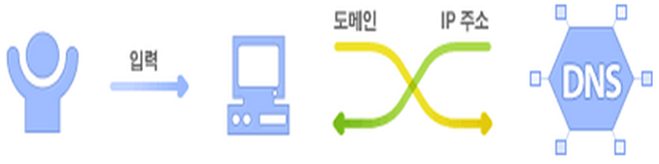

# Network 프로그래밍


## 용어 정의
### 네트워크 정의

> 통신이 가능한 여러 장치들이 데이터 통신을 위해 연결되어 있는 구조(**정보 기기들의 통신망**)를 말한다.

* 정보기기들은 컴퓨터, 스마트 폰, 프린터 등이 Host가 될 수도 있고, Hub, Router 등이 될 수 있다.
* 데이터 통신이란?
  * 네트워크상의 서로 다른 이기종의 정보기기들이 다양한 **통신규약(Protocol)**을 이용하여 데이터를 교환 하는 것


### 통신규약(Protocol) 정의

* 네트워크상의 이기종의 정보 기기들이 데이터를 정확하고, 효율적으로 교환(송수신)하기 위해 연결 방법, 데이터 전달 방식, 데이터 종류, 데이터 형식, 데이터 오류 검출 방식, 전송 속도 등에 대한 통신 규약(약속)을 명세화 한것
* 잘 알려지고, 자주 사용하는 네트워크 프로토콜의 종류
  * 네트워크상의 다양한 이기종 간의 통신을 지원하기 위한 TCP, UDP, IP 등...


### 아이피 주소(IP Address)

* 네트워크상에 연결되어 있는 하나하나의 컴퓨터를 하나의 호스트(Host)라 부르며, 각각의 호스트를 구별하기 위해 컴퓨터와 기타 통신장비에 부여하는 고유한 주소를 아이피 주소(IP address)라 한다.

* 전세계 IP 주소는 InterNic(Internet Network Information Center)에서 관리하며, 한국은 한국인터넷진흥원(KRNic)에서 관리하고 있다.  
* 아이피 주소는 32비트 또는 64비트 숫자로 구성된 주소체계를 사용한다.
* 아이피 주소는 숫자를 그대로 인식하기 힘들기 때문에, 8비트씩 끊어서 표현하는데,  각 자리는 1바이트(0~255) 범위를 갖게 된다
  * 32비트 아이피 주소 체계 : 192.168.0.19
  * 64비트 아이피 주소 체계 : 2001:0:9d38:6ab8:1c61:3db2:3f57:ffec


### 도메인(Domain) / DNS(Domain Name System)

* 도메인이란? 인터넷에 연결된 컴퓨터를 쉽게 찾아 갈 수 있도록 아이피 주소를 사람이 기억하기 쉬운 문자열로 만든 주소형식을 말한다.

  * 172.17.1.50  -> www.naver.com

* DNS는 인터넷상에서 사람들이 인식하기 쉬운 도메인 이름을 컴퓨터가 인식할 수 있도록 IP주소로 변환해주는 시스템을 말한다.

  

* 자바 표준 API에는 네트워크 관련 API로 아이피 주소/도메인을 추상화한 **InetAddress** 클래스를 제공한다.

  ``` java
  import java.net.InetAddress;
  import java.net.UnknownHostException;
  
  /**
   * DNS와의 통신을 통해 IP <-> Domain 정보 제공
   * 
   * @author 정지원
   *
   */
  public class InetAddressExample {
  
  	public static void main(String[] args) throws UnknownHostException {
  		InetAddress ia = InetAddress.getLocalHost();
  		System.out.println(ia.getHostAddress());
  		
  		
  //		String domainName = "www.daum.net";
  		String domainName = "www.naver.com";
  		InetAddress ia2 = InetAddress.getByName(domainName);
  		System.out.println(ia2.getHostAddress());
  		
  		InetAddress[] ia3 = InetAddress.getAllByName(domainName);
  		for (InetAddress inetAddress : ia3) {
  			System.out.println(inetAddress);
  		}
  	}
  }
  ```

  실행 결과

  ```
  192.168.0.136
  125.209.222.141
  www.naver.com/125.209.222.141
  www.naver.com/210.89.164.90
  ```


### 포트

* 포트(Port)는 컴퓨터와 주변장치를 접속하기 위해 사용하는 **물리적 포트**와 네트워크상의 호스트에서 동작하는 통신 프로그램(소트프웨어)이 데이터 송수신을 위해 사용하는 **논리적 포트**로 구분할 수 있다.
  * ip가 인터넷 주소를 정해주는 거라면 포트는 각 컴퓨터 안에서 사용하는 여러 네트워크 프로그램들을 구별하기 위해 사용하는 것이라 생각하자
* 논리적 포트는 프로그램을 구별하는 식별자로 사용된다.
* 논리적인 포트번호는 16비트(0~65,536) 범위의 숫자로 구성된다.
  * 예약 포트(0 ~ 511)
    * FTP, TELNET, HTTP, SMTP 등과 같이 잘 알려진 표준 프로토콜에서 사용하기 위해 예약되어 있는 포트
      * 21(FTP), 23(TELNET), 25(SMTP), POP3(110), 80(HTTP) 등
  * 시스템 포트(512~1024)
    * 운영체제에 의해 예약되어 있는 포트
  * 1025 이상
    * 기타 네트워크 프로그램이 사용하는 포트


### URL(Uniform Resource Locator)

* 인터넷상의 특정 자원(Resource)을 가르키는 고유한 주소 형식을 말한다.

* 만약 URL을 이용할 수 있다면 관련된 정보를 볼 수 있다.

* 형식

  

  	`Protocol://hostname[:port]/path/filename#section`

  * Protocol : 인터넷상의 특정 자원에 접근하기 위해 사용되는 프로토콜
  * HostName(도메인네임 or 아이피주소) : 접근하고자 하는 자원의 주소
  * Port : 네트워크 통신 프로그램을 구별하기 위한 숫자(0~65536)
    * (Echo:7 DayTime:13 FTP:21 Telnet:23 SMPT:25 HTTP:80)
  * Path : 접근하려는 호스트의 리소스 경로
  * FileName : 접근하려는 파일(리소스)
  * Section : 파일내의 특정 위치

* 표준 API에는 URL을 추상화한 URL 클래스를 제공한다.


## 네트워크 통신 모델 및 대표적인 프로토콜(Protocol)

### TCP/IP 표준 통신 모델


* 카톡을 예로 들어보자
* 우리가 카톡을 보낼 때 바로 다른 사람에게 가는 것이 아니라 우리가 보낸 정보가 서버로 보내지는 것.
* 카톡으로 "안녕하세요"를 보냈다고 해보자.
* Application Layer가 카톡이라고 생각하면 된다.
  * 이때 정보를 특정 프로토콜 형식으로 보내게 된다.
  * 이 형식이 HTTP, FTP, SMTP, POP3 등이다.
  * 카톡의 경우에는 자신들이 특정 형식을 만들어 사용할 것이다.
  * 자신들이 만든 프로토콜은 공개하지 않을 것이다.
  * 여기에 "안녕하세요"를 입력했을 것이다.
  * 보내면 다음 계층으로 넘어간다.
* Transfer Layer는 OS에서 제공하는 소프트웨어라고 생각하면 된다.
  * 여기서 전 계층에서 받은 "안녕하세요"를 **패킷 단위**로 잘게 쪼갠다.
  * 이때 쪼개진 패킷들에 순서도 붙여준다. 
  * 이렇게 덧붙여진 정보들을 **패킷 헤더**라 한다.
  * 여기에 꼭 포트 번호도 붙는다.
  * 이때 이런 과정들의 형식이 TCP, UDP이다.
    * TCP는 데이터가 잘 받았는지 확인하는 과정이 있다.
      * 보통은 데이터가 잘 받았는지 확인이 필요하기 때문에 TCP를 많이 사용한다.
    * UDP는 데이터가 잘 받았는지 확인하지 않는다.
      * UDP는 동영상처럼 큰 데이터를 보내고 조그마한 손실이 중요하지 않을때 사용한다.
* Network Layer도 OS에서 제공하는 소프트웨어라고 생각하면 된다.
  * 패킷에 ip를 붙여주는 계층이다.
  * 보낼 곳의 ip를 저장한다??
* DataLink Layer
  * 쪼개져 있던 패킷들을 비트로 붙여주는 작업을 한다.
* Physical Layer
  * 붙여진 비트 정보들을 전기신호로 바꿔서 보내준다.


### Socket

* Socket이 우리가 만들 Application Layer와 아래 계층 전체를 연결해주는 역할을 한다.
  
  * 데이터 종단점 역할을 한다.
  * 이전에 파일에 데이터를 보내서 저장하는 것처럼 소켓을 통해 데이터를 보내면 Application Layer 아래 계층으로 보내준다.
  * 즉, 우리는 서버와 통신을 위해 소켓에 데이터를 보내기만 하면 된다.

* 소켓은 실제 데이터가 어떻게 네트워크로 전송되는지 상관하지 않고, 즉 프로토콜에 상관없이 읽기/쓰기를 위한 인터페이스를 제공한다.

* 소켓은 전송계층과 네트워크계층이 캡슐화 되어 있기 때문에 네트워크 계층에 신경 쓰지 않고 프로그래밍 할 수 있다.

* 코드 예제

  클라이언트 코드 :

  ``` java
  import java.io.IOException;
  import java.io.InputStream;
  import java.io.OutputStream;
  import java.net.InetAddress;
  import java.net.Socket;
  
  /**
   * TCP/IP 기반의 Socket 프로그래밍 원리
   * 
   * @author 정지원
   *
   */
  public class SocketExample {
  
  //	public static final String domain = "www.naver.com";
  //	public static final String domain = "127.0.0.1";
  	public static final String domain = "localhost";
      
  	public static final int port = 7777;
  
  	public static void main(String[] args) {
  
  		Socket socket = null;
  		InputStream in = null;
  		OutputStream out = null;
  		try {
  //			Socket socket = new Socket(InetAddress.getByName(domain), port);
  			socket = new Socket(domain, port);
  
  			System.out.println("서버와 연결됨...");
  			in = socket.getInputStream();
  			out = socket.getOutputStream();
  			out.write(10);
  			System.out.println("서버에 데이터 전송");
  			int data = in.read();
  			System.out.println("서버로부터 에코된 데이터: " + data);
  		} catch (IOException e) {
  			System.out.println("서버를 연결할 수 없습니다...");
  		} finally {
  			try {
  //				out.close(); // out은 socket이 닫힐때 같이 닫히게 된다. 명시적으로 닫아주지 않아도 된다.
  //				in.close(); // in은 socket이 닫힐때 같이 닫히게 된다. 명시적으로 닫아주지 않아도 된다.
  				socket.close();
  			} catch (IOException e) {
  				e.printStackTrace();
  			}
  		}
  	}
  }
  ```

  서버 코드 :

  ``` java
  import java.io.IOException;
  import java.io.InputStream;
  import java.io.OutputStream;
  import java.net.ServerSocket;
  import java.net.Socket;
  
  public class ServerSocketExample {
  
  	public static final int port = 7777;
  
  	public static void main(String[] args) {
  		boolean running = true;
  		try {
  			ServerSocket serverSocket = new ServerSocket(port);
  			System.out.println(port + "포트에서 서버 실행...");
             
              // 클라이언트 연결을 지속적으로 유지하기 위한 while문
  			while (running) {
  				Socket socket = serverSocket.accept();
  				System.out.println("???? 클라이언트가 연결해옴..");
  				InputStream in = socket.getInputStream();
  				OutputStream out = socket.getOutputStream();
  				int data = in.read();
  				System.out.println("클라이언트 수신 데이터:"+data);
  				out.write(data);
  				out.close();
  				in.close();
  				socket.close();
  			}
  		} catch (IOException e) {
  			e.printStackTrace();
  		}
  	}
  }
  ```

  클라이언트 실행 결과

  ```
  서버와 연결됨...
  서버에 데이터 전송
  서버로부터 에코된 데이터: 10
  ```

  서버 실행 결과

  ```
  7777포트에서 서버 실행...
  ???? 클라이언트가 연결해옴..
  클라이언트 수신 데이터:10
  ```


### TCP/UDP 프로토콜 특징

* TCP/UDP 프로토콜은 전송계층(Transfer Layer)에서 사용하는 대표적인 표준 프로토콜로서 운영체제(OS)에서 지원한다.
* TCP(Transfer Control Protocol)는 신뢰할 수 있는 연결 지향 스트림 통신 프로토콜이다. 
* TCP는 전송자가 보낸 순서대로 수신자에게 바이트가 도착하는 것을 책임진다. 
* 데이터가 없어지거나 부분적으로 손상되는 상황을 예방할 수 있기 때문에 네트워크 애플리케이션 구현 시 많이 사용된다(전화에 비유할 수 있다)
* UDP(User Datagram Protocol)는 신뢰할 수 없는 비 연결지향 데이터그램 통신 프로토콜이다. 
* UDP 프로토콜은 간단한 요청 - 응답 메커니즘에 기반으로, 패킷 손실 감지와 재전송 등을 책임지지 않는다(우편물에 비유할 수 있다)