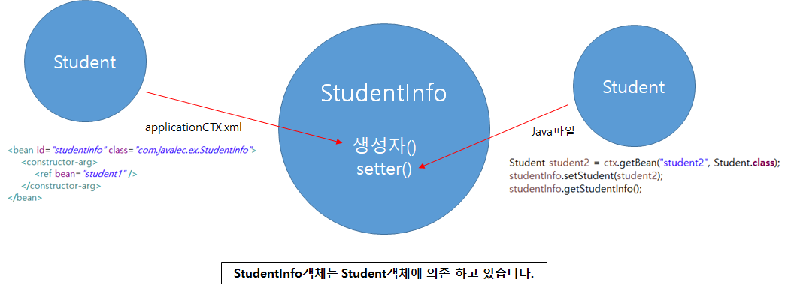

### DI(Dependency Injection)와 IoC컨테이너


* 우리는 A객체에서 B객체와 C객체를 이용할 때 이용하는 방법이 2가지가 있다.

* 첫번째는 A객체 안에 `new B()` `new C()`를 이용해 A객체가 B/C객체를 직접 생성 하는 방법이다.

  * 코드 예제

    ``` java
    class A {
        B b = new B();
        C c = new C();
        
        ...
    }
    ```

* 두번째는 `setter()`또는 `construct()`를 이용해 외부에서 A객체에 넣어 주는 방법이다.

  * 이 방법에서 우린 A객체 안에 B와 C를 담을 수 있는 변수를 만들어 주고 생성자에서 이 변수에 넣어주는 방법이다.

  * 코드 예제

    ``` java
    class A {
        B b;
        C c;
        A(C c){
            this.c = c;
        }
        public setter(B b){
            this.b = b;
        }
        ...
    }
    ```

* 앞의 2가지 방법 중 더 좋은 방법은 두번째 방법이다.

  * 그리고 이 방법을 DI라고 부른다. 의존성을 주입하는 것.
  * 스프링은 이런 방법으로 만들어진다.

* IoC컨테이너는 앞의 예제에서 우리가 주입하는 B, C 클래스들이 모여 있는 상자라고 생각해도 된다.

  * A객체를 자동차라고 했을 때 여기에 바퀴를 단다고 해보자.

  * 바퀴는 여러 종류가 존재하고 이런 바퀴가 모여 있는 상자가 있을 수 있다.

  * 여기서 하나를 골라 우리는 자동차에 끼우게 될것이다.

  * 이때 여러 바퀴 종류들이 모여 있는 상자를 IoC컨테이너라고 하고 상자로부터 바퀴를 꺼내 자동차에 다는 일을 DI라고 부른다.

  * 이렇게 클래스 또한 인터페이스를 통한 부품화가 이루어지고 바퀴처럼 생각할 수 있게 된다.

    

* 그리고 A객체와 DI, IoC컨테이너를 통틀어 스프링이라고 부른다.

* 스프링이란?

  > 부품을 생성하고 조립하는 라이브러리 집합체


### DI(Dependency Injection)

* 스프링을 사용하지 않은 예제

  ``` java
  public class MainClass {
  
  	public static void main(String[] args) {
  		
  		MyCalculator myCalculator = new MyCalculator();
  		myCalculator.setCalculator(new Calculator());
  		
  		myCalculator.setFirstNum(10);
  		myCalculator.setSecondNum(2);
  		
  		myCalculator.add();
  		myCalculator.sub();
  		myCalculator.mul();
  		myCalculator.div();
  
  	}
  
  }
  ```

* 스프링을 사용한 예제

  ``` java
  import org.springframework.context.support.AbstractApplicationContext;
  import org.springframework.context.support.GenericXmlApplicationContext;
  
  public class MainClass {
  
  	public static void main(String[] args) {
  		
  		String configLocation = "classpath:applicationCTX.xml";
  		AbstractApplicationContext ctx = new GenericXmlApplicationContext(configLocation);
  		MyCalculator myCalculator = ctx.getBean("myCalculator", MyCalculator.class);
  		
  		myCalculator.add();
  		myCalculator.sub();
  		myCalculator.mul();
  		myCalculator.div();
  		
  	}
  
  }
  ```

  * classpath에 applicationCTX.xml 이라는 파일을 만들어서 DI를 하는 모습이다.

  * applicationCTX.xml 파일은 Spring Bean Configuration file 이고 이를 이용해 우리는 우리가 사용할 객체들과 변수 값들을 입력해준다. 

    ``` xml
    <!-- applicationCTX.xml 파일 -->
    
    <?xml version="1.0" encoding="UTF-8"?>
    <beans xmlns="http://www.springframework.org/schema/beans"
    	xmlns:xsi="http://www.w3.org/2001/XMLSchema-instance"
    	xsi:schemaLocation="http://www.springframework.org/schema/beans http://www.springframework.org/schema/beans/spring-beans.xsd">
    
        <!-- 내가 수정한 영역 -->
    	<bean id="calculator" class="com.javalec.ex.Calculator"/>
    	
    	<bean id="myCalculator" class="com.javalec.ex.MyCalculator">
    		<property name="calculator">
    			<ref bean="calculator"/>
    		</property>
    		<property name="firstNum" value="10"/>
    		<property name="secondNum" value="2"/>
    	</bean>
        <!-- 내가 수정한 영역 -->
    	
    </beans>
    ```

* 스프링 설정 파일

  * 위에서 applicationCTX.xml이 스프링 설정 파일이다. 이 안에 사용되는 구문들을 자세하게 살펴보자.

    

    * `<bean>` 에는 우리가 사용할 클래스의 정보들을 적어주면 된다.

    * 위의 그림에선 `<bean>`이 2개 이므로 2개의 클래스를 사용한다는 사실을 알 수 있다.

    * 그리고 각각의 bean에는 id와 class가 있는데 class는 우리가 만들고 사용할 클래스 파일을 적어주고 id는 그것의 이름을 정해주는 일이다.

    * 그런데 어떤 클래스들은 변수들을 가지고 있는데 그런 변수들을 `<bean> ... </bean>` 사이에 `<property>`를 통해 알려주게 된다.

    * 위의 그림에선 myCalculator라는 bean의 `<property>`가 3개이므로 이것과 관련된 클래스는 총 3개의 변수를 가지고 있었다는 사실을 알 수 있다.

    * `<property>`에서 name, value 를 볼 수 있는데 name은 클래스 내의 변수 이름을 똑같이 적어주면 되고 value에는 우리가 그 변수에 저장할 값을 적어주면 된다.

    * 이때 value 값이 name의 변수에 들어가게 되는 원리는 우리가 클래스 내에 만들어 주었던 setter를 통해 이루어 지게 된다.

    * 위의 예제에서는 `setFirstNum()`메소드와 `setSecondNum()`이라는 메소드가 MyCalculator 클래스에 만들어져 있을 것이고 이를 통해 값을 전달하게 된다.

    * 마지막으로 property의 속성 중에 `<ref>`가 있는데 이는 레퍼런스 변수와 관련된 속성인데 MyCalculator 안에는 Calculator 클래스로 선언된 calculator 변수가 존재하는 데 이를 표현하기 위해서 `<ref>`를 통해 이 값이 Calculator로 만들어 진것이다 라는 것을 알려주게 된다.

    * 위의 그림에선 `<ref bean="calculaotr"/>`를 통해 우리가 처음에 id를 calculator라고 정했던 bean을 이용해 만들어진 변수라는 것을 알려주게 된다.

    * Calculator 클래스와 MyCalculator 클래스 코드

      ``` java
      public class Calculator {
      
          public void addition(int firstNum,int secondNum)
      	...	
      }
      ```

      ``` java
      public class MyCalculator {
      
      	Calculator calculator;
      	private int firstNum;
      	private int secondNum;
          
      	public void setCalculator(Calculator calculator) {
      		this.calculator = calculator;
      	}
      	
      	public void setFirstNum(int firstNum) {
      		this.firstNum = firstNum;
      	}
      	
      	public void setSecondNum(int secondNum) {
      		this.secondNum = secondNum;
      	}
          ...
      }
      ```

  * 스프링 프로퍼티 설정

    

    * 위의 예제의 경우는 우리가 만든 클래스 안에 기초데이터 변수가 여러 타입(String, double 등)을 가지고 있다.
    * 이럴 때 xml 파일에서 이와 관련된 선언을 해줘야 하는 건 아닌지 의문이 들 수 있지만 기초데이터 타입은 자동으로 알맞는 타입으로 변경시켜 준다.
    * List 타입의 경우에는 `<property> ... </property>` 안에 `<list> ... </list>`를 이용해 값들을 지정해주면 된다.
    * 이때 `<property>`를 이용하면 클래스 안의 `setter메소드`를 이용해 초기화를 하게 된다.

* 스프링 컨테이너의 이해

  

  * 내용 추가!!


### DI활용



* 초기화를 하는 2가지 방법으로 XML 파일을 이용한 방법과 Java 파일을 이용해 하는 방법이 있다.

  * XML을 통해 생성자를 통해 초기화 하는 방법
  * 자바를 통해 초기화 하는 방법

  ``` xml
  <?xml version="1.0" encoding="UTF-8"?>
  <beans xmlns="http://www.springframework.org/schema/beans"
  	xmlns:xsi="http://www.w3.org/2001/XMLSchema-instance"
  	xsi:schemaLocation="http://www.springframework.org/schema/beans http://www.springframework.org/schema/beans/spring-beans.xsd">
  
  	<bean id="student" class="com.javalec.ex.Student">
  		<constructor-arg>
  			<value>정지원</value>
  		</constructor-arg>
  		<constructor-arg>
  			<value>26살</value>
  		</constructor-arg>
  		<constructor-arg>
  			<value>1학년</value>
  		</constructor-arg>
  		<constructor-arg>
  			<value>1반</value>
  		</constructor-arg>
  	</bean>
  	<bean id="student2" class="com.javalec.ex.Student">
  		<constructor-arg value="홍길동"/>
  		<constructor-arg value="24살"/>
  		<constructor-arg value="2학년"/>
  		<constructor-arg value="2반"/>
  	</bean>
  	<bean id="studentInfo" class="com.javalec.ex.StudentInfo">
  		<constructor-arg>
  			<ref bean="student"/>
  		</constructor-arg>
  	</bean>
  
  </beans>
  ```

  * 여기서 `<constructor-arg>`를 통해 값을 넣어주게 되면 setter 메소드가 아닌 생성자를 통해 초기화하게 된다.

  * 즉, 이 방법을 사용하기 위해서는 생성자에 매개변수로 위의 값들을 대입할 수 있게 만들어진 생성자가 존재해야 한다.

    ``` java
    public class Student {
    
    	private String name;
    	private String age;
    	private String gradeNum;
    	private String classNum;
    
    	public Student(String name, String age, String gradeNum, String classNum) {
    		this.name = name;
    		this.age = age;
    		this.gradeNum = gradeNum;
    		this.classNum = classNum;
    	}
        ...
    }
    ```

    ``` java
    public class StudentInfo {
    
    	private Student student;
    	
    	public StudentInfo(Student student) {
    		this.student = student;
    	}
        ...
    }
    ```

* DI사용에 따른 장점

  * 작은 규모의 프로젝트에서는 스프링의 DI를 사용하는 것이 더 느리고 복잡할 수도 있다.
  * 하지만 규모가 어느 정도 커지고 유지보수 업무가 발생시 DI를 이용한 개발의 장점을 느낄 수 있음

  
  위 그림에 대한 **코드 예제**

  ``` java
  import org.springframework.context.support.AbstractApplicationContext;
  import org.springframework.context.support.GenericXmlApplicationContext;
  
  public class MainClass {
  
  	public static void main(String[] args) {
  		// TODO Auto-generated method stub
  		
  		AbstractApplicationContext ctx = new GenericXmlApplicationContext("classpath:applicationCTX5_2.xml");
  		Pencil pencil = ctx.getBean("pencil", Pencil.class);
  		pencil.use();
  		
  		ctx.close();
  	}
  }
  ```

  ``` java 
  public interface Pencil {
  	public void use();
  }
  ```

  ``` java
  public class Pencil4B implements Pencil {
  	@Override
  	public void use() {
  		System.out.println("4B 굵기로 쓰입니다.");
  	}
  }
  ```

  ``` java
  public class Pencil4B implements Pencil {
  	@Override
  	public void use() {
  		System.out.println("4B 굵기로 쓰입니다.");
  	}
  }
  ```

  ``` java
  public class Pencil6BWithEraser extends Pencil6B implements Pencil {
  	@Override
  	public void use() {
  		System.out.println("6B굵기로 쓰이고, 지우개가 있습니다.");
  	}
  }
  ```

  ``` xml
  <?xml version="1.0" encoding="UTF-8"?>
  <beans xmlns="http://www.springframework.org/schema/beans"
  	xmlns:xsi="http://www.w3.org/2001/XMLSchema-instance"
  	xsi:schemaLocation="http://www.springframework.org/schema/beans http://www.springframework.org/schema/beans/spring-beans.xsd">
  
  	<bean id="pencil" class="com.javalec.ex5_2.Pencil4B"/>
  
  </beans>
  ```

  * 위의 코드를 보면 main문에서 인터페이스인 pencil 클래스를 가져오는 것을 알수 있다.
  * 그리고 pencil 클래스를 상속 받는 여러 클래스를 만들면 main문은 변경하지 않아도 나중에 XML 파일에서 관련 bean 값을 변경해주면 사 클래스를 바꿔줄 수 있다.

