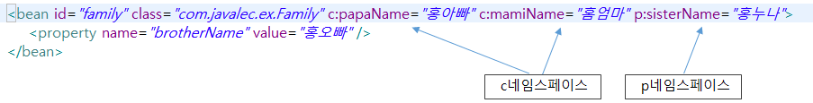
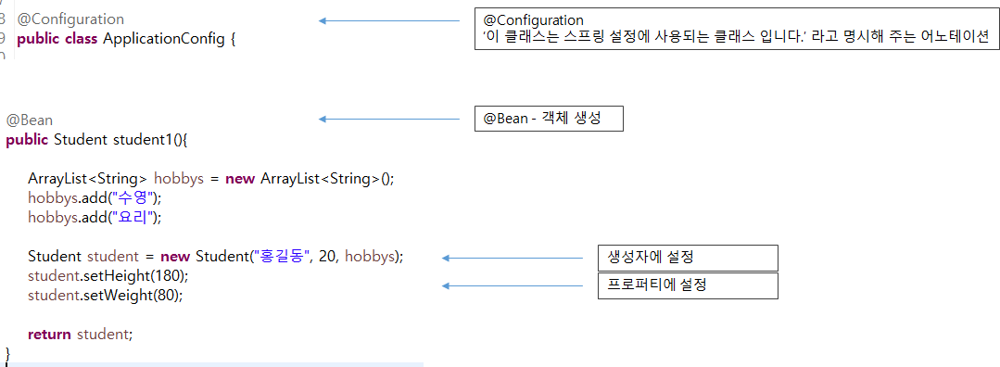

# DI설정 방법

### 1. XML파일을 이용한 DI 설정 방법

#### 예제1


``` java
import java.util.ArrayList;

public class Student {

	private String name;
	private int age;
	private ArrayList<String> hobbys;
	private double height;
	private double weight;
	
	public Student(String name, int age, ArrayList<String> hobbys) {
		this.name = name;
		this.age = age;
		this.hobbys = hobbys;
	}

	public void setName(String name) {
		this.name = name;
	}
    ...
}
```

* 위의 방법은 전에 해왔던 내용들의 집합체이다.


#### 예제2



``` xml
<?xml version="1.0" encoding="UTF-8"?>
<beans xmlns="http://www.springframework.org/schema/beans"
	xmlns:xsi="http://www.w3.org/2001/XMLSchema-instance"
    <!-- 추가된 설정들-->
	xmlns:c="http://www.springframework.org/schema/c"
	xmlns:p="http://www.springframework.org/schema/p"
	<!-- 추가된 설정들-->
	xsi:schemaLocation="http://www.springframework.org/schema/beans http://www.springframework.org/schema/beans/spring-beans.xsd">

	<bean id="student3" class="com.javalec.ex.Student">
		<constructor-arg value="홍길자" />
		<constructor-arg value="8" />
		<constructor-arg>
			<list>
				<value>줄넘기</value>
				<value>공기놀이</value>
			</list>
		</constructor-arg>
		
		<property name="height">
			<value>126</value>
		</property>
		
		<property name="weight" value="21" />
	</bean>
	
	<bean id="family" class="com.javalec.ex.Family" c:papaName="홍아빠" c:mamiName="홈엄마" p:sisterName="홍누나">
		<property name="brotherName" value="홍오빠" />
	</bean>
	
</beans>
```

``` java
public class Family {

	String papaName;
	String mamiName;
	String sisterName;
	String brotherName;
	
	public Family(String papaName, String mamiName) {
		this.papaName = papaName;
		this.mamiName = mamiName;
	}
    ...
}
```

* 위의 xml 파일은 예제1에서 한것과 동일하지만 모습이 다르다고 이해하면 된다.
* 예제1에서 값들을 초기화 해주기 위해서 계속 `<constructor-arg>, <property>`를 사용하는데 이것을 적는게 귀찮을 수도 있다.
* 이럴 때 bean에 관련된 정보를 적어주며 바로 관련된 값들을 적어줄 수 있다.
* `c:papaName="홍아빠"` 라는 글에서 `c`는 constructor-arg의 약자라고 생각하면 된다. 그리고 콜론 뒤의 `papaName`은 우리가 사용할 클래스 내에서 정의된 변수명이다. 그리고 그 변수에 `"홍아빠"`라는 값을 넣어주게 된다.
* `p:sisterName="홍누나"` 에서 `p`는 property의 약자라 생각하면 되고 나머지는 위와 똑같이 생각하면 된다. 다만 이경우에 sisterName을 setter를 통해 설정해주는 것 뿐이다.
* **(중요)** 이 네임스페이스는 사용하기 위해서 <beans>에 관련된 방법을 사용한다는 것을 알려주어야 한다.


### 2. Java를 이용한 DI 설정 방법



자바로 DI를 하려면 어노테이션을 반드시 추가해야 함.

* 클래스 앞에 `@Configuration` 이라는 어노테이션을 추가해주면 이 클래스는 스프링 설정에 사용되는 클래스 입니다. 라고 명시해주는 것

  ``` java
  @Configuration
  public class AppplicationConfig {...}
  ```

* 앞에 `@Bean`이라는 어노테이션을 통해 객체 생성을 한다는 것을 명시해줌

  ``` java
  @Bean
  public Student student1() {
      
      ArrayList<String> hobbys = new ArrayList<String>();
      hobbys.add("수영");
      hobbys.add("요리");
      
      Student student = new Student("홍길동", 20, hobbys);
      student.setHeight(180);
      student.setWeight(80);
      
      return student;
  }
  ```

  * 위에서 처음에 `@Bean`을 통해 아래의 코드가 객체 생성을 해준다는 것을 알 수 있다.
  * `student1`이라는 Student  클래스를 만든 것
  * `Student student = new Student("홍길동", 20, hobbys);`처럼 생성자를 이용해 값을 만들고 마지막에 `return student;`를 통해 관련된 값을 전달해준다.

* Student 클래스

  ``` java
  import java.util.ArrayList;
  
  public class Student {
  
  	private String name;
  	private int age;
  	private ArrayList<String> hobbys;
  	private double height;
  	private double weight;
  	
  	public Student(String name, int age, ArrayList<String> hobbys)
      {
  		this.name = name;
  		this.age = age;
  		this.hobbys = hobbys;
  	}
      ...
  }
  ```

  Student 클래스를 이용해 만든 자바 Configuration 파일

  ``` java
  import org.springframework.context.annotation.Bean;
  import org.springframework.context.annotation.Configuration;
  
  @Configuration
  public class ApplicationConfig {
  
  	@Bean
  	public Student student1(){
  		
  		ArrayList<String> hobbys = new ArrayList<String>();
  		hobbys.add("수영");
  		hobbys.add("요리");
  		
  		Student student = new Student("홍길동", 20, hobbys);
  		student.setHeight(180);
  		student.setWeight(80);
  		
  		return student;
  	}
  	
  	@Bean
  	public Student student2(){
  		
  		ArrayList<String> hobbys = new ArrayList<String>();
  		hobbys.add("독서");
  		hobbys.add("음악감상");
  		
  		Student student = new Student("홍길순", 18, hobbys);
  		student.setHeight(170);
  		student.setWeight(55);
  		
  		return student;
  	}
  	
  }
  ```

  실행을 위한 main문

  ``` java
  import org.springframework.context.annotation.AnnotationConfigApplicationContext;
  
  public class MainClass {
  
  	public static void main(String[] args) {
  		AnnotationConfigApplicationContext ctx = new AnnotationConfigApplicationContext(ApplicationConfig.class);
  		
  		Student student1 = ctx.getBean("student1", Student.class);
  		System.out.println("이름 : " + student1.getName());
  		System.out.println("나이 : " + student1.getAge());
  		System.out.println("취미 : " + student1.getHobbys());
  		System.out.println("신장 : " + student1.getHeight());
  		System.out.println("몸무게 : " + student1.getWeight());
  		
  		Student student2 = ctx.getBean("student2", Student.class);
  		System.out.println("이름 : " + student2.getName());
  		System.out.println("나이 : " + student2.getAge());
  		System.out.println("취미 : " + student2.getHobbys());
  		System.out.println("신장 : " + student2.getHeight());
  		System.out.println("몸무게 : " + student2.getWeight());
  		
  		ctx.close();
  	}
  	
  }
  ```


### 3. XML과 JAVA를 같이 사용


XML과 JAVA를 같이 사용하려면 위 그림에서 둘 중 한가지 방법을 무조건 택해서 사용해야 한다.


#### 1. XML파일에 JAVA파일을 포함시켜 사용하는 방법

먼저 자바를 이용해 Configuration을 해주는 코드를 만들자.

``` java
import java.util.ArrayList;

import org.springframework.context.annotation.Bean;
import org.springframework.context.annotation.Configuration;

@Configuration
public class ApplicationConfig {

	@Bean
	public Student student1(){
		
		ArrayList<String> hobbys = new ArrayList<String>();
		hobbys.add("수영");
		hobbys.add("요리");
		
		Student student = new Student("홍길동", 20, hobbys);
		student.setHeight(180);
		student.setWeight(80);
		
		return student;
	}
	
}
```

그리고 XML을 이용해 위에서 만든 Configuration을 가져와 사용하는 코드를 만들면 우린 XML안에서 JAVA파일을 포함시켜 사용하는, 처음 그림에서 왼쪽의 방법을 사용할 수 있게 된다.

``` xml
<?xml version="1.0" encoding="UTF-8"?>
<beans xmlns="http://www.springframework.org/schema/beans"
	xmlns:xsi="http://www.w3.org/2001/XMLSchema-instance"
	xmlns:context="http://www.springframework.org/schema/context"
	xsi:schemaLocation="http://www.springframework.org/schema/beans http://www.springframework.org/schema/beans/spring-beans.xsd
		http://www.springframework.org/schema/context http://www.springframework.org/schema/context/spring-context-3.2.xsd">
	
    <!-- 새롭게 추가된 방법 -->
	<context:annotation-config />
	<bean class="com.javalec.ex.ApplicationConfig" />
	<!-- 새롭게 추가된 방법 -->
    
	<bean id="student2" class="com.javalec.ex.Student">
		<constructor-arg value="홍길순"></constructor-arg>
		<constructor-arg value="30"></constructor-arg>
		<constructor-arg >
			<list>
				<value>마라톤</value>
				<value>요리</value>
			</list>
		</constructor-arg>
		<property name="height" value="190" />
		<property name="weight" value="70" />
	</bean>

</beans>
```

위의 XML파일에서 이 전과 다른 곳은 `<context:annotation-config />`가 붙은 bean 문장이다. 우리가 만든 java configuration 파일을 사용하기 위해서는  `<context:annotation-config />`을 우리가 사용할 자바 파일 앞에 붙여 줘야 한다.

다음은 자바로 만든 Configuration을 포함하는 XML만을 구현해 사용하는 main 문 코드이다.

``` java
import org.springframework.context.support.AbstractApplicationContext;
import org.springframework.context.support.GenericXmlApplicationContext;

public class MainClass {

		public static void main(String[] args) {
			
			AbstractApplicationContext ctx = new GenericXmlApplicationContext("classpath:applicationCTX.xml");
			Student student1 = ctx.getBean("student1", Student.class);
			System.out.println("이름 : " + student1.getName());
			System.out.println("나이 : " + student1.getAge());
			System.out.println("취미 : " + student1.getHobbys());
			System.out.println("키 : " + student1.getHeight());
			System.out.println("몸무게 : " + student1.getWeight());
			
			Student student2 = ctx.getBean("student2", Student.class);
			System.out.println("이름 : " + student2.getName());
			System.out.println("나이 : " + student2.getAge());
			System.out.println("취미 : " + student2.getHobbys());
			System.out.println("키 : " + student2.getHeight());
			System.out.println("몸무게 : " + student2.getWeight());
			
			ctx.close();
		}
	
}
```

여기서  우리는 우리가 만든 자바 Configuration 파일을 바로 이용하지 않는 것을 확인할 수 있다.


#### 2. JAVA 파일 안에 XML 파일을 포함해 사용하는 방법

이번엔 먼저 XML 파일을 만들자.

``` xml
<?xml version="1.0" encoding="UTF-8"?>
<beans xmlns="http://www.springframework.org/schema/beans"
	xmlns:xsi="http://www.w3.org/2001/XMLSchema-instance"
	xsi:schemaLocation="http://www.springframework.org/schema/beans http://www.springframework.org/schema/beans/spring-beans.xsd">
	
	<bean id="student2" class="com.javalec.ex.Student">
		<constructor-arg value="홍길순"></constructor-arg>
		<constructor-arg value="30"></constructor-arg>
		<constructor-arg >
			<list>
				<value>마라톤</value>
				<value>요리</value>
			</list>
		</constructor-arg>
		<property name="height" value="190" />
		<property name="weight" value="70" />
	</bean>

</beans>
```

그리고 나서 자바 configuration 파일을 만들자.

``` java
import java.util.ArrayList;

import org.springframework.context.annotation.Bean;
import org.springframework.context.annotation.Configuration;
import org.springframework.context.annotation.ImportResource;

@Configuration
@ImportResource("classpath:applicationCTX.xml")
public class ApplicationConfig {

	@Bean
	public Student student1(){
		
		ArrayList<String> hobbys = new ArrayList<String>();
		hobbys.add("수영");
		hobbys.add("요리");
		
		Student student = new Student("홍길동", 20, hobbys);
		student.setHeight(180);
		student.setWeight(80);
		
		return student;
	}
	
}
```

위의 자바 코드에서 이전과 다른 부분인 `@ImportResource("classpath:applicationCTX.xml")`이 적혀있는 것을 볼 수 있다. 우린 이 어노테이션을 통해 해당이름으로 만들어진 XML 파일을 이용할 것이다라는 것을 알려줄 수 있게 된다.

``` java
import org.springframework.context.annotation.AnnotationConfigApplicationContext;
import org.springframework.context.support.AbstractApplicationContext;
import org.springframework.context.support.GenericXmlApplicationContext;

public class MainClass {

		public static void main(String[] args) {
			
			AnnotationConfigApplicationContext ctx = new AnnotationConfigApplicationContext(ApplicationConfig.class);
			
			Student student1 = ctx.getBean("student1", Student.class);
			System.out.println("이름 : " + student1.getName());
			System.out.println("나이 : " + student1.getAge());
			System.out.println("취미 : " + student1.getHobbys());
			System.out.println("키 : " + student1.getHeight());
			System.out.println("몸무게 : " + student1.getWeight());
			
			Student student2 = ctx.getBean("student2", Student.class);
			System.out.println("이름 : " + student2.getName());
			System.out.println("나이 : " + student2.getAge());
			System.out.println("취미 : " + student2.getHobbys());
			System.out.println("키 : " + student2.getHeight());
			System.out.println("몸무게 : " + student2.getWeight());
			
			ctx.close();
			
		}
	
}
```

그래서 이번 main문에서는 어노테이션을 사용한 자바 Configuration 파일을 사용하는 방법만이 사용되어 있는 것을 확인할 수 있다.