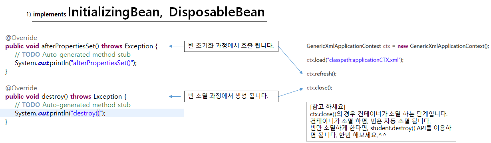
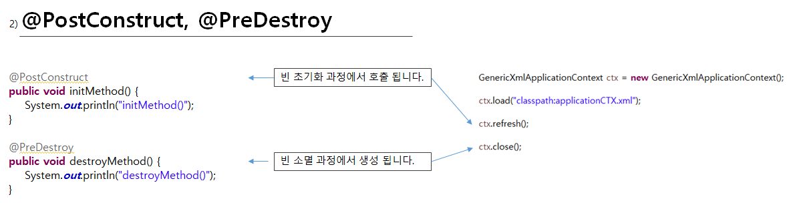
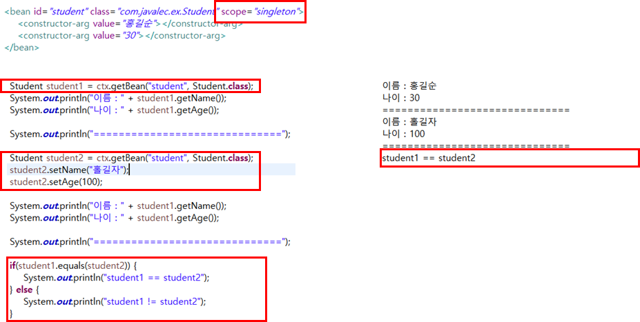

# 생명 주기(life cycle) 와 범위(scope)

### 1. 스프링 컨테이너 생명 주기


* 컨테이너는 크게 생성 - 설정 - 사용 - 종료의 주기를 가진다.
* 위의 코드에서 주의해야 할것은 `ctx`에 생성해 삽입할 때 바로 어떤 클래스를 사용할지 알려주지 않으면  `load`와 `refresh`를 이용해 알려주어야 한다.
* 이때 `refresh`를 꼭 해줘야 어떤 것을 사용하는지 알려줄 수 있다.


### 2. 스프링 빈 생명 주기

#### 1. implemets InitializingBean, DisposableBean



* 이 두가지는 인터페이스
* 무조건 실현해야 해야 빈을 만들 수 있는 것은 아니지만 만약 한다면 꼭 오버라이딩 해야하는 메소드가 각각 1개씩 존재한다.
* `afterPropertiesSet()`이라는 메소드는 InitializingBean을 실현할 때 오버라이딩해야 하는 메소드인데 빈 초기화 과정에서 호출 되는 메소드이다.
* `DisposableBean()`이라는 메소드는 DisposableBean을 실현할 대 오버라이딩 해야 하는 메소드이다. 빈 소멸 과정에서 생성된다
* 만약 빈 생성이나 소멸시 해야할 것이 있을 때 위의 방법을 사용하면 된다.


#### 2. @PostConstruct, @PreDestroy



* 위의 두가지 방법은 인터페이스를 이용할 때랑 다르게 무조건 만들어야 하거나 하는 것은 아님
* 다만 빈 초기화나 소멸 과정에서 해야할 것이 생겼을 때 `@PostConstruct, @PreDestroy`을 이용해 원하는 작업을 해줄 수 있다.


#### 위의 1번과 2번을 모두 사용한 코드 예제

1번 방법을 사용한 자바 코드 :

``` java
import org.springframework.beans.factory.DisposableBean;
import org.springframework.beans.factory.InitializingBean;

public class Student implements InitializingBean, DisposableBean{

	private String name;
	private int age;
	
	public Student(String name, int age) {
		this.name = name;
		this.age = age;
	}

	public String getName() {
		return name;
	}
	
	public int getAge() {
		return age;
	}

	@Override
	public void afterPropertiesSet() throws Exception {
		// TODO Auto-generated method stub
		System.out.println("afterPropertiesSet()");
	}

	@Override
	public void destroy() throws Exception {
		// TODO Auto-generated method stub
		System.out.println("destroy()");
	}
	
}
```

2번 방법을 이용한 자바 코드 :

``` java
import javax.annotation.*;

public class OtherStudent  {

	private String name;
	private int age;
	
	public OtherStudent(String name, int age) {
		this.name = name;
		this.age = age;
	}

	public String getName() {
		return name;
	}
	
	public int getAge() {
		return age;
	}
	
	@PostConstruct
	public void initMethod() {
		System.out.println("initMethod()");
	}
	
	@PreDestroy
	public void destroyMethod() {
		System.out.println("destroyMethod()");
	}

}
```

관련된 XML 파일

``` java
<?xml version="1.0" encoding="UTF-8"?>
<beans xmlns="http://www.springframework.org/schema/beans"
	xmlns:xsi="http://www.w3.org/2001/XMLSchema-instance"
	xmlns:context="http://www.springframework.org/schema/context"
	xsi:schemaLocation="http://www.springframework.org/schema/beans http://www.springframework.org/schema/beans/spring-beans.xsd
		http://www.springframework.org/schema/context http://www.springframework.org/schema/context/spring-context-3.2.xsd">
	
	<context:annotation-config />
	
	<bean id="student" class="com.javalec.ex.Student">
		<constructor-arg value="홍길순"></constructor-arg>
		<constructor-arg value="30"></constructor-arg>
	</bean>
	
	<bean id="otherStudent" class="com.javalec.ex.OtherStudent">
		<constructor-arg value="홍길자"></constructor-arg>
		<constructor-arg value="50"></constructor-arg>
	</bean>
	
</beans>
```

위의 1번 2번 방법을 구현한 메인 메소드

``` java
package com.javalec.ex;

import org.springframework.context.support.GenericXmlApplicationContext;

public class MainClass {

	public static void main(String[] args) {
		
		GenericXmlApplicationContext ctx = new GenericXmlApplicationContext();

		ctx.load("classpath:applicationCTX.xml");
		
		ctx.refresh();
		
		ctx.close();
		
	}
	
}
```

실행 결과 :

```
afterPropertiesSet()
initMethod()
destroyMethod()
destroy()
```


### 3. 스프링 빈 범위(scope)

스프링 컨테이너가 생성되고, 스프링 빈이 생성 될 때, 생성된 스프링 빈은 scope를 가지고 있다.

범위란 쉽게 생각해서 해당하는 객체가 어디까지 영향을 미치는지 결정하는 것이라고 생각하면 된다.



* XML에서 bean을 보면 `scope="singleton"`이라는 구문이 포함되어 있다.

  * 사실 생략하면 자동으로 `singleton`으로 생성된다.

* 이때 다음 코드의 결과를 예측해보자

  ``` xml
  <?xml version="1.0" encoding="UTF-8"?>
  <beans xmlns="http://www.springframework.org/schema/beans"
  	xmlns:xsi="http://www.w3.org/2001/XMLSchema-instance"
  	xsi:schemaLocation="http://www.springframework.org/schema/beans http://www.springframework.org/schema/beans/spring-beans.xsd">
  	
  	<bean id="student" class="com.javalec.ex.Student" scope="singleton">
  		<constructor-arg value="홍길순"></constructor-arg>
  		<constructor-arg value="30"></constructor-arg>
  	</bean>
  
  </beans>
  ```

  ``` java
  package com.javalec.ex;
  
  import org.springframework.context.support.AbstractApplicationContext;
  import org.springframework.context.support.GenericXmlApplicationContext;
  
  public class MainClass {
  
  	public static void main(String[] args) {
  		
  		AbstractApplicationContext ctx = new GenericXmlApplicationContext("classpath:applicationCTX.xml");
  		
  		Student student1 = ctx.getBean("student", Student.class);
  		System.out.println("이름 : " + student1.getName());
  		System.out.println("나이 : " + student1.getAge());
  		
  		System.out.println("==============================");
  		
  		Student student2 = ctx.getBean("student", Student.class);
  		student2.setName("홀길자");
  		student2.setAge(100);
  		
  		System.out.println("이름 : " + student1.getName());
  		System.out.println("나이 : " + student1.getAge());
  		
  		System.out.println("==============================");
  
  		if(student1.equals(student2)) {
  			System.out.println("student1 == student2");
  		} else {
  			System.out.println("student1 != student2");
  		}
  		
  		ctx.close();
  		
  	}
  }
  ```

  * 이때 다음의 결과가 나오는 것은 쉽게 생각할 수 있을 것이다.

    ```
    이름 : 홍길순
    나이 : 30
    ==============================
    이름 : 홀길자
    나이 : 100
    ==============================
    ```

  * 그런데 마지막 if구문이 어떻게 작동할지 생각해봐야 한다.

  * 여기서는 `student1 == student2`가 출력되는 것이 정답이다.

  * 그 이유는 이미 `AbstractApplicationContext ctx = new GenericXmlApplicationContext("classpath:applicationCTX.xml");`을 통해서 우리는 ctx에 bean을 메모리에 생성해놨다고 생성할 수 있다. 그리고 `ctx.getbean()`메소드를 통해 생성되어 있던 메모리에 접근하는 것이라고 생각하면된다.

  * 이렇게 접근한 메모리 주소를 `student1`과 `student2`에 저장하는 것이라고 생각하면 된다.