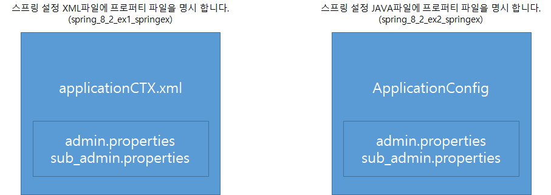
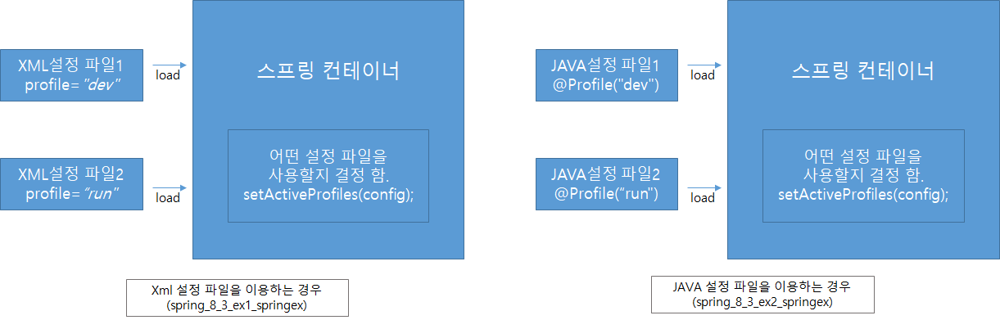

# 외부파일을 이용한 설정

#### 1. Environment 객체


* 우리가 프로젝트를 할 때 어떤 정보들이 필요할 수 있음
* 이런 관련된 정보를 자바 내에 가지고 있는 것이 아니라 외부에 가지고 있다가 가져 오는 것
* 이때 어떤 정보가 변했을 때 자바 파일을 변경하는 것이 아니라 외부 설정 파일을 변경하면 된다.

* 어플리케이션의 가장 기본이 되는 Context를 만들고 Environment를 가져옴.

  * 이때 `getEnvironment()`를 이용해 가져오게 된다.

* Environment 에는 여러 PropertySources가 존재함.

  * `getPropertySources()`를 통해 가져올 수 있음.
  * 이 PropertySources에 우리가 원하는 정보가 들어 있음.
  * 만약 이 정보를 가져오고 싶다면 우리가 원하는 PS에 접근을 바로 하지는 못하고 알아서 스캔해서 찾아와 우리에게 정보를 전달해준다.

* 코드 예제

  Context 파일

  ``` java
  package com.javalec.ex;
  
  import java.io.IOException;
  
  import org.springframework.context.ConfigurableApplicationContext;
  import org.springframework.context.support.GenericXmlApplicationContext;
  import org.springframework.core.env.ConfigurableEnvironment;
  import org.springframework.core.env.MutablePropertySources;
  import org.springframework.core.io.support.ResourcePropertySource;
  
  public class MainClass {
  
  	public static void main(String[] args) {
  		
  		ConfigurableApplicationContext ctx = new GenericXmlApplicationContext();
  		ConfigurableEnvironment env = ctx.getEnvironment();
  		MutablePropertySources propertySources = env.getPropertySources();
  		
  		try {
  			propertySources.addLast(new ResourcePropertySource("classpath:admin.properties"));
  			
  			System.out.println( env.getProperty("admin.id") );
  			System.out.println( env.getProperty("admin.pw") );
  		} catch (IOException e) {}
  		
  		GenericXmlApplicationContext gCtx = (GenericXmlApplicationContext)ctx;
  		gCtx.load("applicationCTX.xml");
  		gCtx.refresh();
  		
  		AdminConnection adminConnection = gCtx.getBean("adminConnection", AdminConnection.class);
  		System.out.println("admin ID : " + adminConnection.getAdminId());
  		System.out.println("amdin PW : " + adminConnection.getAdminPw());
  		
  		gCtx.close();
  		ctx.close();
  		
  	}
  }
  ```

  ``` properties
  admin.id=abcde
  admin.pw=12345
  ```

  ``` xml
  <?xml version="1.0" encoding="UTF-8"?>
  <beans xmlns="http://www.springframework.org/schema/beans"
  	xmlns:xsi="http://www.w3.org/2001/XMLSchema-instance"
  	xsi:schemaLocation="http://www.springframework.org/schema/beans http://www.springframework.org/schema/beans/spring-beans.xsd">
  
  	<bean id="adminConnection" class="com.javalec.ex.AdminConnection" />
  
  </beans>
  ```

  ``` java
  package com.javalec.ex;
  
  import org.springframework.beans.factory.DisposableBean;
  import org.springframework.beans.factory.InitializingBean;
  import org.springframework.context.EnvironmentAware;
  import org.springframework.core.env.Environment;
  
  public class AdminConnection implements EnvironmentAware, InitializingBean, DisposableBean {
  
  	private Environment env;
  	private String adminId;
  	private String adminPw;
  	
  	@Override
  	public void setEnvironment(Environment env) {
  		System.out.println("setEnvironment()");
  		setEnv(env);
  	}
  	
  	public void setEnv(Environment env) {
  		this.env = env;
  	}
  	
  	public void setAdminId(String adminId) {
  		this.adminId = adminId;
  	}
  	
  	public void setAdminPw(String adminPw) {
  		this.adminPw = adminPw;
  	}
  	
  	public String getAdminId() {
  		return adminId;
  	}
  	
  	public String getAdminPw() {
  		return adminPw;
  	}
  	
  	@Override
  	public void afterPropertiesSet() throws Exception {
  		System.out.println("afterPropertiesSet()");
  		setAdminId(env.getProperty("admin.id"));
  		setAdminPw(env.getProperty("admin.pw"));
  	}
  
  	@Override
  	public void destroy() throws Exception {
  		System.out.println("destroy()");
  	}
  
  }
  ```

  * `EnvironmentAware` 인터페이스는 구현하면 `setEnvironment()`메소드를 오버라이딩해야함
    * 이 메소드는 빈이 생성되기 전에 먼저 환경 설정을 해주는 인터페이스라고 생각해도 된다.
    * 이 인터페이스를 구현함으로써 우리는 우리가 정한 Enviroment 변수에 원하는 값을 대입할 수 있다.
  * `InitializingBean`, `DisposableBean`은 우리가 전에 배웠던 빈이 생성될때와 없어질때 실행되는 메소드가 들어있는 인터페이스들이다.

  실행 결과

  ```
  abcde
  12345
  
  ...
  
  setEnvironment()
  afterPropertiesSet()
  admin ID : abcde
  amdin PW : 12345
  
  ...
  
  destroy()
  ```


#### 프로퍼티 파일을 이용한 설정



* Enviroment 객체를 사용하지 않고 프로퍼티 파일을 이용하여 스프링 빈을 설정하는 방법

* 이때도 2가지 방법이 존재함

  * 스프링 설정 XML 파일에 프로퍼티 파일을 명시하는 방법
  * 스프링 설정 JAVA 파일에 프로퍼티 파일을 명시하는 방법

* 스프링 설정 XML 파일에 프로퍼티 파일을 명시하는 방법

  ``` xml
  <?xml version="1.0" encoding="UTF-8"?>
  <beans xmlns="http://www.springframework.org/schema/beans"
  	xmlns:xsi="http://www.w3.org/2001/XMLSchema-instance"
  	xmlns:context="http://www.springframework.org/schema/context"
  	xsi:schemaLocation="http://www.springframework.org/schema/beans http://www.springframework.org/schema/beans/spring-beans.xsd
  		http://www.springframework.org/schema/context http://www.springframework.org/schema/context/spring-context-3.2.xsd">
  	
  	<context:property-placeholder location="classpath:admin.properties, classpath:sub_admin.properties" />
  	
  	<bean id="adminConnection" class="com.javalec.ex.AdminConnection" >
  		<property name="adminId">
  			<value>${admin.id}</value>
  		</property>
  		<property name="adminPw">
  			<value>${admin.pw}</value>
  		</property>
  		<property name="sub_adminId">
  			<value>${sub_admin.id}</value>
  		</property>
  		<property name="sub_adminPw">
  			<value>${sub_admin.pw}</value>
  		</property>
  	</bean>
  
  </beans>
  ```

  * 위의 xml 파일은 전과 비슷하지만 달라진 부분이 몇 군데 존재함
  * bean을 생성하고 안에 value들을 property를 이용해 대입을 해주는데 바로 값을 대입해주는 것이 아니라 어떤 주소를 이용해 값을 입력함
  * 이를 위해 추가 된 구문이 `<context:property-placeholder location="classpath:admin.properties, classpath:sub_admin.properties" />`인데 이를 통해 우리가 사용할 프로퍼티가 어떤 것인지를 알려줌.
    * 이때 우리는 2가지 프로퍼티를 가져오게 되는 것(admin, sub_admin)
  * 그리고 우리가 이런 context를 사용한다는 것을 알려주기 위해 `xmlns:context="http://www.springframework.org/schema/context"`를 초반 빈 설정에 추가해주어야 함.
    * 이걸 직접 적어줘도 되지만 이클립스에서는 xml 파일을 열면 아래쪽 Namespaece 탭에 보면 관련 설정을 할 수 있음

* 스프링 설정 JAVA 파일에 프로퍼티 파일을 명시하는 방법

  ``` java
  package com.javalec.ex;
  
  import org.springframework.beans.factory.annotation.Value;
  import org.springframework.context.annotation.Bean;
  import org.springframework.context.annotation.Configuration;
  import org.springframework.context.support.PropertySourcesPlaceholderConfigurer;
  import org.springframework.core.io.ClassPathResource;
  import org.springframework.core.io.Resource;
  
  @Configuration
  public class ApplicationConfig {
  
  	@Value("${admin.id}")
  	private String adminId;
  	@Value("${admin.pw}")
  	private String adminPw;
  	@Value("${sub_admin.id}")
  	private String sub_adminId;
  	@Value("${sub_admin.pw}")
  	private String sub_adminPw;
  	
      // 무조건 이걸 만들어야 프로퍼티를 이용할 수 있음.
  	@Bean
  	public static PropertySourcesPlaceholderConfigurer Properties() {
  		PropertySourcesPlaceholderConfigurer configurer = new PropertySourcesPlaceholderConfigurer();
  		
  		Resource[] locations = new Resource[2];
  		locations[0] = new ClassPathResource("admin.properties");
  		locations[1] = new ClassPathResource("sub_admin.properties");
  		configurer.setLocations(locations);
  		
  		return configurer;
  	}
  	
  	@Bean
  	public AdminConnection adminConfig() {
  		AdminConnection adminConnection = new AdminConnection();
  		adminConnection.setAdminId(adminId);
  		adminConnection.setAdminPw(adminPw);
  		adminConnection.setSub_adminId(sub_adminId);
  		adminConnection.setSub_adminPw(sub_adminPw);
  		return adminConnection;
  	}
  	
  }
  ```

  * `public static PropertySourcesPlaceholderConfigurer Properties()`를 무조건 만들어야 자바 config 파일을 이용해 프로퍼티를 이용할 수 있음
    * 이 `@Bean`안에서 우리가 사용할 프로퍼티 주소들을 return 해줘야 함.
    * `static`이라 생성될때 메모리에 먼저 만들어짐
  * `@Value("${admin.id}")`와 같은 Value어노테이션을 통해 값을 저장할 수 있음


#### 프로파일(profile) 속성을 이용한 설정



* 동일한 스프링 빈을 여러 개 만들어 놓고 상황(환경)에 따라서 적절한 스프링 빈을 사용할 수 있다.

* 우리가 사이트를 만든다고 할 때 개발자가 하는 일이 모두 사용자에게 보이면 좋지 않을 수 있다. 이럴때는 개발자가 사용하는 설정 파일 사용자가 사용하는 설정 파일을 만들어서 따로따로 쓰면 좋을 것

* 이 프로파일을 이용한 설정 또한 XML을 이용하는 방법과 JAVA설정 파일을 이용하는 방법이 있음

* XML설정 파일을 이용하는 방법

  ``` xml
  <!-- applicationCTX_dev.xml -->
  
  <?xml version="1.0" encoding="UTF-8"?>
  <beans xmlns="http://www.springframework.org/schema/beans"
  	xmlns:xsi="http://www.w3.org/2001/XMLSchema-instance"
  	xsi:schemaLocation="http://www.springframework.org/schema/beans http://www.springframework.org/schema/beans/spring-beans.xsd"
  	profile="dev">
  
  	<bean id="serverInfo" class="com.javalec.ex.ServerInfo">
  		<property name="ipNum" value="localhost"></property>
  		<property name="portNum" value="8181"></property>
  	</bean>
  
  </beans>
  ```

  ``` xml
  <!-- applicationCTX_run.xml -->
  
  <?xml version="1.0" encoding="UTF-8"?>
  <beans xmlns="http://www.springframework.org/schema/beans"
  	xmlns:xsi="http://www.w3.org/2001/XMLSchema-instance"
  	xsi:schemaLocation="http://www.springframework.org/schema/beans http://www.springframework.org/schema/beans/spring-beans.xsd"
  	profile="run">
  
  	<bean id="serverInfo" class="com.javalec.ex.ServerInfo">
  		<property name="ipNum" value="213.186.229.29"></property>
  		<property name="portNum" value="80"></property>
  	</bean>
  
  </beans>
  ```

  * 이 두 XML 파일에서 다른 부분은 property부분도 있지만 `<beans>` 설정에 `profile="dev"` or `profile="run"`이 들어 있느냐 이다.
  * 이 두가지 프로파일을 메인클래스에서 잘 이용하면 된다.

  ``` java
  package com.javalec.ex;
  
  import java.util.Scanner;
  
  import org.springframework.context.support.GenericXmlApplicationContext;
  
  public class MainClass {
  
  	public static void main(String[] args) {
  		
  		String config = null;
  		Scanner scanner = new Scanner(System.in);
  		String str = scanner.next();
  		if(str.equals("dev")) {
  			config = "dev";
  		} else if(str.equals("run")) {
  			config = "run";
  		}
  		
  		scanner.close();
  		
  		GenericXmlApplicationContext ctx = new GenericXmlApplicationContext();
  		ctx.getEnvironment().setActiveProfiles(config);
  		ctx.load("applicationCTX_dev.xml", "applicationCTX_run.xml");
  		
  		
  		ServerInfo info = ctx.getBean("serverInfo", ServerInfo.class);
  		System.out.println("ip : " + info.getIpNum());
  		System.out.println("port : " + info.getPortNum());
  		ctx.close();
  		
  	}
  	
  }
  ```

  * 위의 메인클래스를 보면 사용자로부터 dev나 run을 입력받으면 그 값을 `config`에 저장시켜 놨다가 `ctx.getEnvironment().setActiveProfiles(config);`와 같은 코드를 이용해 활성화될 프로파일을 설정해주고 관련 정보를 불러오게 된다.

* JAVA 설정 파일을 이용하는 방법

  ``` java
  // ApplicationConfigDev.java
  
  package com.javalec.ex;
  
  import org.springframework.context.annotation.Bean;
  import org.springframework.context.annotation.Configuration;
  import org.springframework.context.annotation.Profile;
  
  @Configuration
  @Profile("dev")
  public class ApplicationConfigDev {
  	
  	@Bean
  	public ServerInfo serverInfo() {
  		ServerInfo info = new ServerInfo();
  		info.setIpNum("localhost");
  		info.setPortNum("8181");
  		return info;
  	}
  	
  }
  ```

  ``` java
  // ApplicationConfigRun.java
  
  package com.javalec.ex;
  
  import org.springframework.context.annotation.Bean;
  import org.springframework.context.annotation.Configuration;
  import org.springframework.context.annotation.Profile;
  
  @Configuration
  @Profile("run")
  public class ApplicationConfigRun {
  
  	@Bean
  	public ServerInfo serverInfo() {
  		ServerInfo info = new ServerInfo();
  		info.setIpNum("213.186.229.29");
  		info.setPortNum("80");
  		return info;
  	}
  	
  }
  ```

  * 위의 두 자바 설정 파일에서 새로 추가된 어노테이션은 `@Profile("~~")`이다.
  * 이를 통해 간단하게 우리가 프로파일 설정이 가능하다.

  ``` java
  package com.javalec.ex;
  
  import java.util.Scanner;
  
  import org.springframework.context.annotation.AnnotationConfigApplicationContext;
  import org.springframework.context.support.GenericXmlApplicationContext;
  
  public class MainClass {
  
  	public static void main(String[] args) {
  		
  		String config = null;
  		Scanner scanner = new Scanner(System.in);
  		String str = scanner.next();
  		if(str.equals("dev")) {
  			config = "dev";
  		} else if(str.equals("run")) {
  			config = "run";
  		}
  		
  		scanner.close();
  		
  		AnnotationConfigApplicationContext ctx = new AnnotationConfigApplicationContext();
  		ctx.getEnvironment().setActiveProfiles(config);
  		ctx.register(ApplicationConfigDev.class, ApplicationConfigRun.class);
  		ctx.refresh();
  		
  		ServerInfo info = ctx.getBean("serverInfo", ServerInfo.class);
  		System.out.println("ip : " + info.getIpNum());
  		System.out.println("port : " + info.getPortNum());
  		ctx.close();
  		
  	}
  	
  }
  ```
